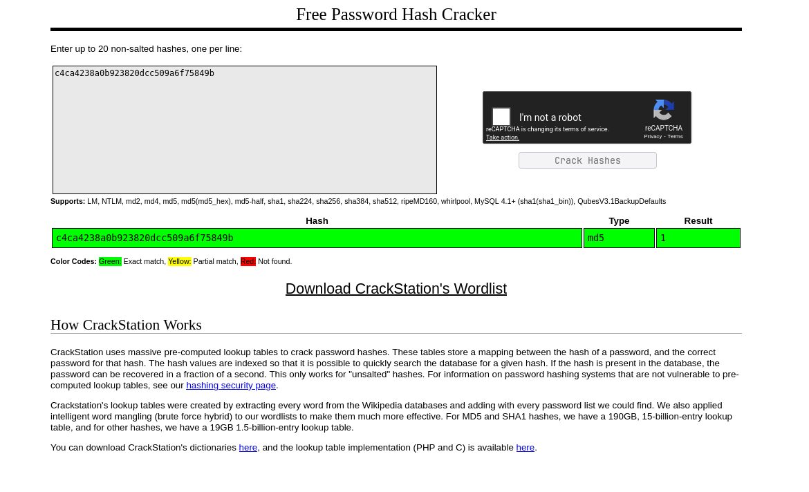

- In the description of this room, they mention that we have to use an `IDOR` vulnerability to get the flag.
- They also talk about `URL` endpoints that look like hashes.
- So let’s take a look at the website:


- We see a picture with different doors.
- When we hover over these doors, the cursor changes to a pointer, which indicates that the doors are clickable.
- First, I clicked on the first door on the left side and saw the following:


- We are greeted with a picture of an empty room.
- When we look at the `URL`, we can see the endpoints that were mentioned earlier:

```
http://10.64.140.192/c4ca4238a0b923820dcc509a6f75849b
```

- Let’s check whether this endpoint is actually a hash.
- To do this, we can go to https://crackstation.net/ and paste it in:



- We can see that this is indeed an `MD5` hash and that it represents the value `1`.
- If we repeat this process with the other endpoints, we can see that they correspond to the IDs `1–13`.
- A logical next step is to hash an ID that is not yet present, such as `0` or `14`, and try to access it directly.
- The `MD5` hash representation of the string `0` is:

```
cfcd208495d565ef66e7dff9f98764da
```

(Source: https://emn178.github.io/online-tools/md5.html)

- Now we request the following URL:

```
http://10.64.140.192/cfcd208495d565ef66e7dff9f98764da
```

- This successfully reveals the flag:


