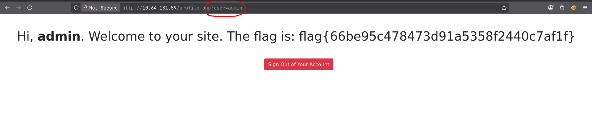

## IDOR Basics:
---
- in the description of this room was mentioned that we can check out `IDOR` because its similar content 
- so I assume that we will find a `IDOR`-vulnerability in this room
- `IDOR` stands for `Insecure Direct Object Reference` 
- This type of vulnerability can occur when a web server uses user-owned data to retrieve objects
- `Example`: 
	- we just created a new bank-account and view the new account and we see this `URL` in the Browser: 
	```
	http://online-service.thm/profile?user_id=1305
	```
	- we see that their is a `user_id` set 
	- if we try to change that `id` to another number and get content from other bank-accounts 
	- then we know that their is a `IDOR`-vulnerability present 
## IDOR Vulnerability:
---
- the description also said that we have to navigate to `http://<Machine-IP-Adress` 
- so lets do that:

- we see a `login-form` and a message that we should check out the `source-code` if we don't have a account 
- so lets do it 
- we find a `HTML-comment`: 
```html
<!-- use guest:guest credentials until registration is fixed. "admin" user account is off limits!!!!! -->
```
- so lets use `guest:guest` to login 


- after we logged in we see a `welcome-message` and a `logout` button 
- but lets ignore this and look at the `URL`: 
```
http://10.64.181.59/profile.php?user=guest
```
- we see that the `profile.php` has a variable set that stores a `user` value that is currently set to `guest` 
- so that could be the `IDOR` that they talked about
- when we look at the `comment` again: 
```html
<!-- use guest:guest credentials until registration is fixed. "admin" user account is off limits!!!!! -->
```
- there is a `admin` account mentioned, so lets try to store that in the `user` variable 
- after we did this, we get this `page-content`: 

